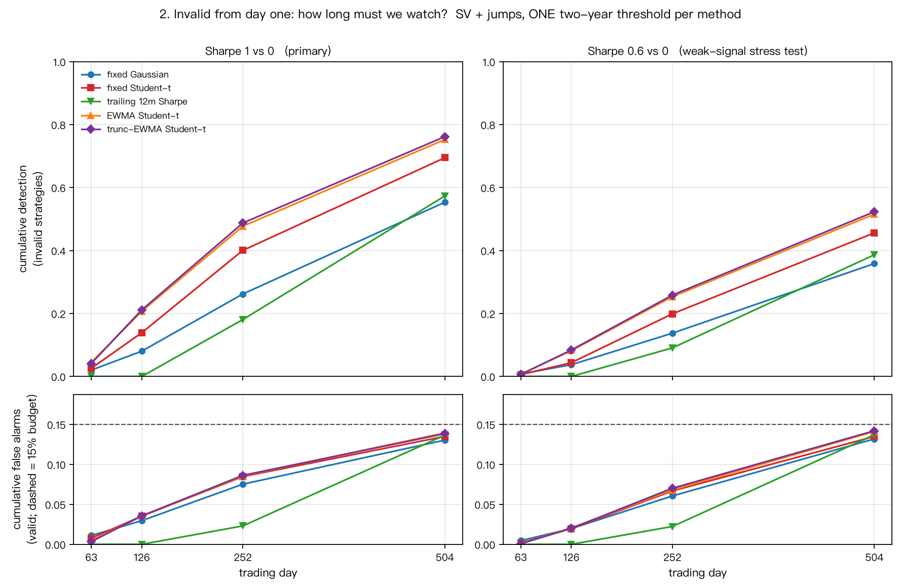

# strategy-survivorship

一个新策略上线后要么有效、要么无效。**在可接受的累计误杀约束下，多快能识别出无效的那一个？**
本仓库用模拟数据回答这个问题，并把结果解释成交易日、年数、检出比例与失效概率。

全部为模拟研究，**不是真实市场部署的验证**。

- **先读**：[`docs/BRIEF.md`](docs/BRIEF.md) —— 两页导师简报，四张主图。
- **接手项目**：[`docs/HANDOFF_COMPANY_CLAUDE.md`](docs/HANDOFF_COMPANY_CLAUDE.md) —— 完整方法、协议、指标定义与数据出处。
- **推导**：[`theory.md`](theory.md)。
- **各阶段报告**：`outputs/stage*_report.md`。

---

## 核心结果（Sharpe 1 对 0 为主线）

主情境「随机波动率 + 跳跃」，两年累计误杀预算 15%，最好的方法是截断 EWMA Student-t：

| 观察时长 | 一个季度 | 半年 | 一年 | 两年 |
|---|---|---|---|---|
| **Sharpe 1（主线）** | 4.1% | 21.1% | 48.7% | **76.2%** |
| Sharpe 0.6（弱信号压力测试） | 0.6% | 8.4% | 25.8% | **52.3%** |

中位检出时间：s=1 约 260 天，s=0.6 约 475 天。

三步稳健处理的贡献量级依次递减：重尾似然 +13.4 pp、方差自适应 +6.4 pp、截断更新 +0.7 pp；
**在纯高斯情境里这套处理反而是负收益（−3.2 pp）**。



---

## 环境与运行

```bash
python -m venv .venv
.venv/bin/pip install -r requirements-lock.txt
.venv/bin/pip install -e .
.venv/bin/python -m pytest -q
```

### 不需要重跑实验的操作

```bash
make brief          # 重画四张主图（只读 CSV）
make figures        # 重画全部阶段图（只读 CSV）
make report-only    # 重生成阶段报告（只读 CSV）
```

### 完整复现（约 10 分钟，按顺序）

```bash
for s in stage1 stage11 stage2a stage2b stage2c stage2d stage2e stage2e1 \
         stage3a stage3a1 stage3b; do
  .venv/bin/python -m strategy_survivorship.run_$s
done
.venv/bin/python -m strategy_survivorship.figures_brief
```

阶段之间有依赖：Stage 2D 读 Stage 2C 的统一门槛，Stage 3B 读 Stage 3A 的冻结门槛。

---

## 研究路线

| 阶段 | 问题 | 报告 |
|---|---|---|
| 1 | 最小可复现流程：模拟→检测→校准→评估 | [`stage1_report.md`](outputs/stage1_report.md) |
| 1.1 | 失效概率与时间的对应 | [`stage11_report.md`](outputs/stage11_report.md) |
| 2A | 厚尾、随机波动率、跳跃下的压力测试 | [`stage2a_report.md`](outputs/stage2a_report.md) |
| 2B | 因果 EWMA 方差预测是否有用 | [`stage2b_report.md`](outputs/stage2b_report.md) |
| 2C | 环境未知时的统一门槛与误杀控制 | [`stage2c_report.md`](outputs/stage2c_report.md) |
| 2D | 随机波动率与跳跃同时存在 | [`stage2d_report.md`](outputs/stage2d_report.md) |
| 2E | 截断方差更新的 2×2 消融 | [`stage2e_report.md`](outputs/stage2e_report.md) |
| 2E.1 | 收尾、跨预算统计、高斯理论参照 | [`stage2e1_report.md`](outputs/stage2e1_report.md) |
| 3A | 弱信号 Sharpe 0.6，保留 1 作参照 | [`stage3a_report.md`](outputs/stage3a_report.md) |
| 3A.1 | 监测期限本身是不是原因 | [`stage3a1_report.md`](outputs/stage3a1_report.md) |
| 3B | 先有效、后失效（第一年内） | [`stage3b_report.md`](outputs/stage3b_report.md) |

**负面结果保留在报告里**：高斯情境下稳健处理的代价、门槛迁移失败、弱信号低检出、
以及基线方法在某些设定下胜出，都没有被筛掉。

---

## 目录

```
src/strategy_survivorship/   模型、DGP、校准、评估、绘图与报告生成
tests/                       307 项测试：定义、因果性、协议、评分口径
outputs/                     全部结果 CSV/JSON、各阶段报告与图
docs/                        导师简报、交接文档、四张主图
theory.md                    完整推导
```

`outputs/` 里的结果由 tag `pre-consolidation` 生成；审阅包是构建产物，
用 `make bundle` 重建或从该 tag 取回。

---

## 限制

模拟研究；候选 Sharpe 只有 {1, 0.6} 且检测器知道候选值；五个噪声情境同出一族；
Stage 3B 只覆盖第一年内失效；校准只覆盖所列固定情境；全部区间为逐项区间；
评价只含检出率与误杀率，**等待成本未纳入**。
