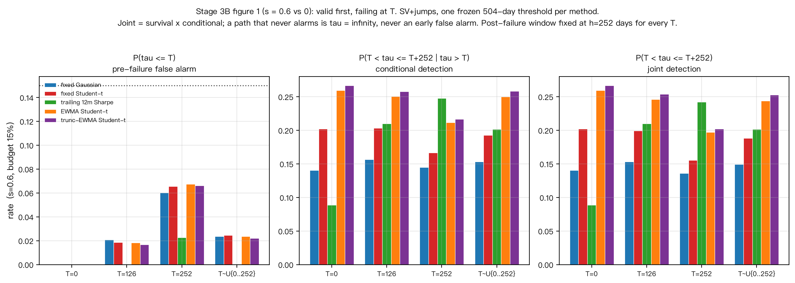
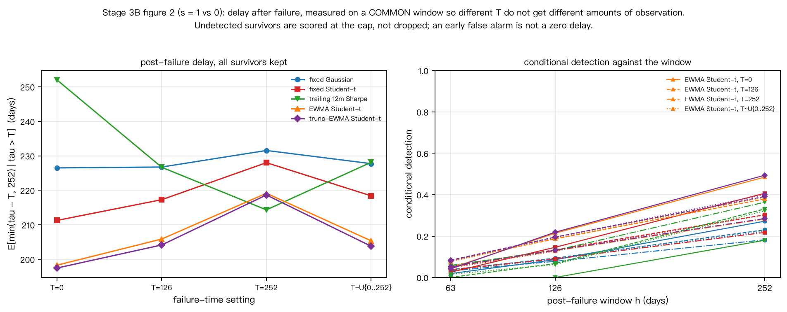
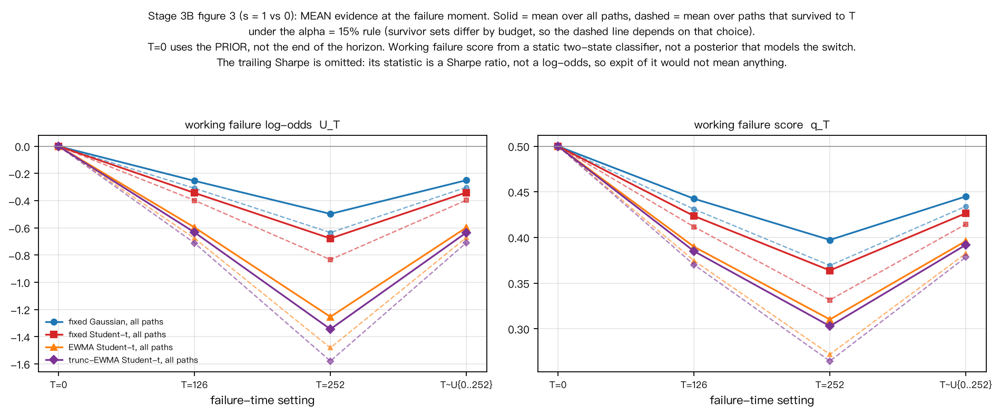

# 附录：补充结果与诊断

主报告见 [`BRIEF.md`](BRIEF.md)；本文件收纳 α=5% 的完整结果、弱信号对照、
以及延迟与历史证据两类诊断图。全部由 `make figures` 从既有 CSV 重画，不重跑模拟。

---

## A. α = 5%（更严格的误杀预算）

主情境「SV+跳跃」，两年检出率：

| 方法 | s=1, α=15% | s=1, α=5% | s=0.6, α=15% | s=0.6, α=5% |
|---|---|---|---|---|
| 固定 Gaussian | 55.34% | 29.14% | 35.85% | 15.47% |
| 固定 Student-t | 69.47% | 46.27% | 45.61% | 23.46% |
| trailing 12m Sharpe | 57.32% | 31.74% | 38.65% | 16.82% |
| EWMA Student-t | 75.26% | 55.54% | 51.54% | 28.52% |
| 截断 EWMA Student-t | 76.17% | 57.16% | 52.32% | 29.81% |

数据：`outputs/stage3a_metrics.csv`，筛选 `scenario=sv_jump`。

高斯理论参照（仅适用于 iid 高斯对照，两年）：

| s | α=5% | α=15% |
|---|---|---|
| 1.0 | 40.88% | 64.72% |
| 0.6 | 21.29% | 42.55% |

数据：`outputs/stage3a_gaussian_reference.csv`。

---

## B. 弱信号对照（Sharpe 0.6）

Stage 3B 的三类展示，s=0.6：

对照 s=1 的同一张图见 [`../outputs/figures/fig3b1_rates_s1.png`](../outputs/figures/fig3b1_rates_s1.png)。

**Stage 3B 事先写定的主比较用的是 s=0.6**；按导师要求，简报的展示重点改为 s=1，
但协议记录不改写。

---

## C. 失效后延迟

`E[min(τ−T, 252) | τ > T]` 的分母是**全部存活到 T 的路径**：未检出的存活者按窗口上限
计入而不是删去，被提前误杀的路径不计为零延迟（它根本不在存活集合里）。
不同 h 的上限不同，**跨窗口不可比**。

s=0.6 的对应图：[`fig3b2_delay_s06.png`](../outputs/figures/fig3b2_delay_s06.png)。

---

## D. 失效时刻的历史证据

画的是**均值**；虚线是在 α=15% 规则下存活到 T 的路径子集（存活集合随预算改变）。
`T=0` 取先验值，不取数组最后一天。

`trailing_sharpe_252` 不在图中：它的统计量是年化 Sharpe 比率，不在对数赔率尺度上，
对它取 `expit` 得到的数没有可解释含义。所有概率相关字段对它留空。

这是**工作失效分数**——静态两状态分类器在切换数据上的输出，
不是对状态切换过程的正确后验概率。

s=0.6 的对应图：[`fig3b3_evidence_s06.png`](../outputs/figures/fig3b3_evidence_s06.png)。

---

## E. 概率随观测增长

导师关心失效概率随时间的变化。相关诊断入口：

| 内容 | 文件 |
|---|---|
| q 的中位数与 10–90% 分位（两种真实状态、四个日期） | `outputs/stage3a_failure_probability.csv` |
| 首次达到 q≥0.9 的累计比例（含有效策略误达比例） | `outputs/stage3a_probability_level.csv` |
| Brier 分数与分箱可靠性（每箱带样本量） | `outputs/stage3a_brier.csv` / `_reliability.csv` |
| 失效时刻的 q 与对数赔率 | `outputs/stage3b_evidence.csv` |

**这些 q 都是工作分数**：由静态两状态分类器产生。
「首次达到 q≥0.9 的比例」是解释性刻度，**不是** α=10% 的误杀控制，
必须与有效策略错误达到该水平的比例一起读。

---

## F. 其它阶段的诊断图

| 图 | 内容 |
|---|---|
| `outputs/figures/fig2e{1..4}_*.png` | 截断消融：机制、2×2、预设差与交互项、误杀时点分解 |
| `outputs/figures/fig3a{1..4}_*.png` | 弱信号：检出曲线、预设差、失效概率、高斯参照 |
| `outputs/figures/fig3a1_{1..3}_*.png` | 监测期限：两种安排、B−A、短门槛延用 |
| `outputs/figures/fig2{a,b,c,d}*_*.png` | 早期阶段的噪声、EWMA、统一门槛、组合 DGP 诊断 |
