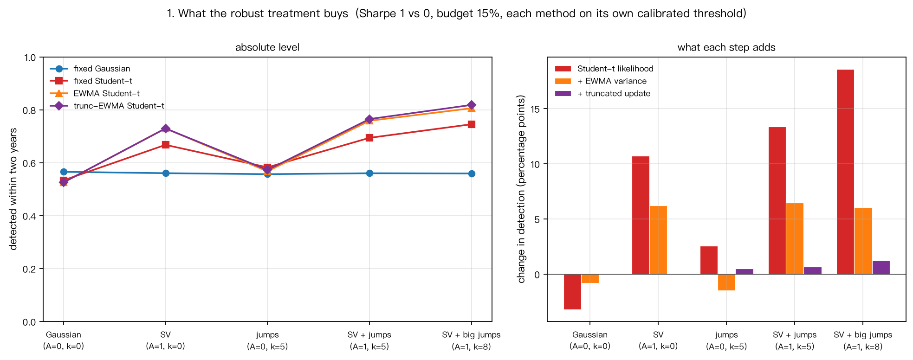
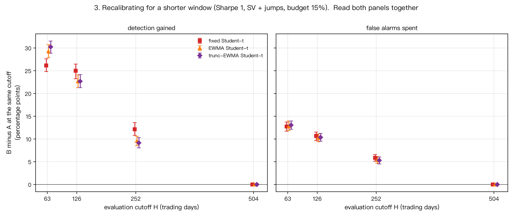
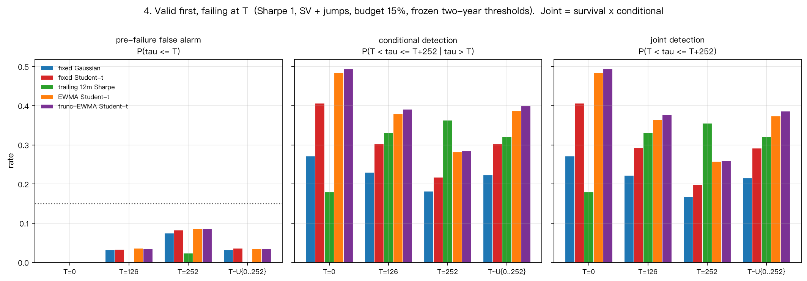

# 新策略有效性监测：本周研究简报

**问题.** 一个策略上线时要么有效、要么无效。在可接受的累计误杀约束下，多快能识别出无效的那一个？

**设定.** 全部为模拟数据。日收益 `r_t = μ_S + σ₀ε_t`，年化波动率 10%，D=252 交易日，监测期 H=504 天（两年），初始先验 0.5。有效状态 `μ₁ = s·σ_ann/D`，无效状态 `μ₀ = 0`。**主线是 s=1 对 0**（导师指定）；s=0.6 是后加的弱信号压力测试。噪声从独立高斯逐步加到「随机波动率 + 跳跃」的组合情境。误杀预算取两年累计 15%（主）与 5%（补充）。

所有结论都来自这套模拟，**不是真实市场部署的验证**，也不是关于任何检测规则的普遍最优结论。

---

## 一、稳健处理带来什么改善（s=1）

在主情境「SV+跳跃」、α=15% 下，两年检出率逐级提升：

| 方法 | 两年检出 | 相对上一行的增量 |
|---|---|---|
| 固定 Gaussian | 56.03% | — |
| 固定 Student-t | 69.41% | +13.4 pp（重尾似然） |
| EWMA Student-t | 75.86% | +6.4 pp（方差自适应） |
| 截断 EWMA Student-t | 76.51% | +0.7 pp（截断更新） |

三步的贡献量级相差很大：**重尾似然最大，方差自适应次之，截断更新是一个小而可测的补充**。

**代价必须一起说.** 在纯高斯情境里这套处理是**负收益**（−3.2 pp），因为那里没有厚尾也没有波动聚集可利用。方法的优势依赖于噪声结构，不是普遍的。

---

## 二、上线即无效时，需要观察多久（s=1 为主）

主情境、α=15%、最好的方法（截断 EWMA Student-t）：

| | 一个季度 | 半年 | 一年 | 两年 | 中位检出 |
|---|---|---|---|---|---|
| **s=1（主线）** | 4.1% | 21.1% | 48.7% | **76.2%** | 260 天 |
| s=0.6（压力测试） | 0.6% | 8.4% | 25.8% | **52.3%** | 475 天 |

**这是本周最重要的一个数字：即使在导师指定的 s=1 主线上，一年只能抓到约一半，两年约四分之三。**中位检出时间约 13 个月。信号减弱到 0.6 后，两年检出降到约一半，中位检出推迟到 22 个月以上。

**一个有条件的理论参照.** 在独立高斯、方差已知、两个候选均值已知的模型里，两年检出率存在与规则无关的上界 `Φ(s√h − z₁₋α)`：s=1、α=15% 时为 64.7%，s=0.6 时为 42.6%。在我们的高斯对照里所有方法都低于它。**但它不适用于 SV+跳跃情境**——那里的数据分布与时间结构不同，我们的方法在该情境达到 76% 并不矛盾。组合情境**没有**已知上界，因此不能把任何剩余差距称作「信息上限」。

---

## 三、监测期限怎样改变结果

如果专门为半年监测重新校准门槛（安排 B），而不是读两年门槛在半年处的表现（安排 A）：

| | 半年检出 | 已花掉的累计误杀 |
|---|---|---|
| A（两年门槛读半年） | 20.21% | 3.28% |
| B（专为半年校准） | 42.91% | 13.50% |

差为 **+22.70 pp 检出，+10.22 pp 误杀**。两个数必须一起读：**两种安排看到的收益、统计量、似然增量逐日完全相同**，B 只是把原本留给后一年半的误杀预算提前花掉，模型没有因此获得新的信息。

**短期门槛不继承长期保证.** 把按 63 天校准的门槛继续用到第 504 天，实际累计误杀达到 **40.3%**（它自己窗口的预算是 15%）；126 天门槛延用到两年是 28.9%。

---

## 四、先有效、后失效时会怎样

策略在第 T 天之后失效（T 是最后一个有效日）。**覆盖范围是「一年内失效」**（T ≤ 252），不是多年寿命研究。门槛沿用两年冻结值，不按真实 T 校准。

三个量必须一起读（联合检出 = 存活率 × 条件检出）：

| 失效设定 | 方法 | 失效前误杀 | 条件检出 | 联合检出 |
|---|---|---|---|---|
| T=0 | EWMA Student-t | 0.00% | 48.49% | 48.49% |
| T=252 | EWMA Student-t | 8.69% | 28.23% | 25.78% |
| T=252 | trailing 12m Sharpe | 2.36% | 36.36% | 35.50% |
| 随机 T | EWMA Student-t | 3.58% | 38.74% | 37.35% |

两点结论：

1. **EWMA Student-t 相对固定 Student-t 的优势在所有失效设定下都保持**（条件检出差 +6.5 到 +8.5 pp，全部排除 0）。
2. **方法排序随失效时刻改变.** EWMA t 相对 trailing Sharpe 的联合检出差在 T=0 为 +30.5 pp，在 T=252 为 **−9.7 pp**，随机 T 下为 +5.2 pp。本轮**没有分解**这一反转的成因；至少四条机制可能同时起作用：滚动方法的启动期、滚动窗口逐步移除失效前数据、方差状态、以及存活者筛选。因此既不能说 trailing Sharpe「判别能力更强」，也不能说它「只是窗口对齐」。

---

## 五、限制

- 全部为模拟；候选 Sharpe 只取 {1, 0.6}，噪声情境有限，不覆盖真实收益的其它失效方式。
- Stage 3B 只覆盖第一年内失效，不是 0–5 年或 0–10 年的寿命研究。
- 校准只覆盖所列固定情境，不构成未知环境下的统一门槛保证。
- 所有比较区间都是逐项区间，未做多重比较校正。
- 评价指标只有检出率与误杀率，**等待成本未纳入**：多监测一年半意味着无效策略继续运行、继续占用资金与风险额度。

---

## 六、下周需要导师决定的优先级

1. **失效时间的覆盖范围是否从一年扩展到数年？** 那需要更长的模拟期限，并会改变「两年监测」这个主基准的含义。
2. **是否需要一个显式建模状态切换的检测器？** 本轮只说明静态两状态分类器在切换数据上仍能工作，没有比较过任何切换感知的方法（BOCPD 一类）。
3. **失效前误杀与失效后延迟按什么代价函数权衡？** 至今只分别报告，没有赋权。

复现与数据来源见 [`README.md`](../README.md)；完整方法、协议与逐项数据出处见 [`docs/HANDOFF_COMPANY_CLAUDE.md`](HANDOFF_COMPANY_CLAUDE.md)。
