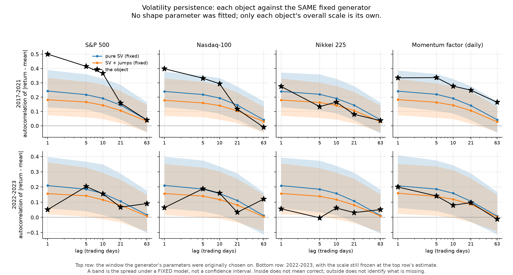

# Cross-market fixed-baseline contrast

find which real objects the existing controllable-Sharpe generator already resembles, so the NEXT small calibration has a target. This stage fits nothing. **every shape parameter is the value already in config.py; the only quantity estimated per object is its overall scale.**

Description and scale window 2017-01-01 to 2021-12-31; frozen-parameter contrast 2022-01-01 to 2023-12-31. a frozen-parameter development contrast. It is development data that has already been examined, not a new independent test. 2024-2025 takes no part in any statistic, figure or choice this round.


## 1. The objects, and what the data looked like

| object | kind | calendar | describe n | contrast n | annualised sd (describe) | defects |
|---|---|---|---|---|---|---|
| S&P 500 | price_index | nyse | 1258 | 501 | 19.24% | none |
| Nasdaq-100 | price_index | nyse | 1258 | 501 | 22.62% | 1 price(s) printed on a day the calendar says the exchange was closed (2019-04-19) -- dropped at the analysis layer, the next return re-formed from the adjacent valid closes |
| Nikkei 225 | price_index | jpx | 1220 | 490 | 18.52% | none |
| Momentum factor (daily) | factor_return | nyse | 1259 | 501 | 18.86% | none |

Chosen before any result was seen: **S&P 500** — the object stages 1-4 calibrated against; **Nasdaq-100** — same country and calendar, different composition -- separates composition from window; **Nikkei 225** — a different exchange calendar and a different crisis timing; **Momentum factor (daily)** — a long-short STRATEGY return rather than a price index; chosen for the type it adds, not for how it fits.

Two things about the data are worth stating plainly. FRED's `NASDAQ100` prints a price on **2019-04-19, Good Friday**, a day the US equity market was closed; `SP500` correctly leaves it blank. The row is **kept and reported**, not deleted, so the Nasdaq-100 series carries one trading day the calendar says should not exist. And the Nikkei's non-trading days are taken from the source file's own blank rows, because this repository has no encoded JPX calendar — so its blanks are not cross-validated against an independent holiday list the way the two US series are.

The momentum factor is a **long-short factor return**, already a return. It is used as published, converted from percent to decimal once, never differenced and never compounded into a price first.


## 2. Scale handling

- **per object** — sigma_annual = sd(returns in the describe window) * sqrt(252), estimated separately for each object
- **frozen** — the SAME scale is used for the contrast period. The later period's realised volatility never rescales a main result.
- **level versus shape** — the RV_21 quantiles are reported TWICE and the two must not be confused. As LEVELS they compare the market and the simulation at the same frozen sigma_annual. As SHAPE they are divided by the series' OWN annualised sd -- and for a simulation that ratio is formed INSIDE each path before any quantile is taken across paths, because dividing every path by one common number is a different quantity.
- **cross market shape** — scale-free statistics (tails, ACF, W1 on standardised returns, concentration, lead-lag) are compared directly; the volatility range is compared through the per-path shape ratio above.
- **no unified leaderboard** — stage 4's per-branch standardised total loss is NOT reused here and no object is ranked by a single total score.


## 3. Gap overview

How many statistics in each group fall inside the simulated 2.5–97.5% range. **These are coverage counts, not a score**: no object is ranked by a total, and stage 4's per-branch standardised loss is not reused here.

### 2017-2021 — the description window

| object | model | volatility range | tails (counts) | persistence | concentration | return vs future variance | W1 ÷ reference |
|---|---|---|---|---|---|---|---|
| S&P 500 | gaussian | 0/3 | 1/6 | 1/5 | 0/1 | 1/3 | 9.57 |
| S&P 500 | stoch_vol | 2/3 | 4/6 | 2/5 | 1/1 | 3/3 | 3.25 |
| S&P 500 | sv_jump | 3/3 | 5/6 | 2/5 | 0/1 | 2/3 | 1.99 |
| Nasdaq-100 | gaussian | 0/3 | 1/6 | 1/5 | 0/1 | 2/3 | 7.37 |
| Nasdaq-100 | stoch_vol | 3/3 | 5/6 | 4/5 | 1/1 | 3/3 | 2.20 |
| Nasdaq-100 | sv_jump | 3/3 | 5/6 | 2/5 | 1/1 | 3/3 | 1.37 |
| Nikkei 225 | gaussian | 0/3 | 2/6 | 1/5 | 0/1 | 3/3 | 4.56 |
| Nikkei 225 | stoch_vol | 3/3 | 6/6 | 5/5 | 1/1 | 3/3 | 1.01 |
| Nikkei 225 | sv_jump | 3/3 | 6/6 | 5/5 | 1/1 | 3/3 | 0.92 |
| Momentum factor (daily) | gaussian | 0/3 | 1/6 | 0/5 | 0/1 | 2/3 | 7.29 |
| Momentum factor (daily) | stoch_vol | 3/3 | 5/6 | 5/5 | 1/1 | 3/3 | 2.16 |
| Momentum factor (daily) | sv_jump | 3/3 | 6/6 | 0/5 | 1/1 | 2/3 | 1.43 |

### 2022-2023 — frozen parameters and frozen scale

| object | model | volatility range | tails (counts) | persistence | concentration | return vs future variance | W1 ÷ reference |
|---|---|---|---|---|---|---|---|
| S&P 500 | gaussian | 1/3 | 5/6 | 3/5 | 1/1 | 2/3 | 1.76 |
| S&P 500 | stoch_vol | 3/3 | 6/6 | 4/5 | 1/1 | 3/3 | 0.90 |
| S&P 500 | sv_jump | 3/3 | 6/6 | 5/5 | 1/1 | 2/3 | 1.09 |
| Nasdaq-100 | gaussian | 0/3 | 5/6 | 2/5 | 1/1 | 3/3 | 1.37 |
| Nasdaq-100 | stoch_vol | 3/3 | 6/6 | 5/5 | 1/1 | 3/3 | 1.08 |
| Nasdaq-100 | sv_jump | 2/3 | 6/6 | 5/5 | 1/1 | 3/3 | 1.31 |
| Nikkei 225 | gaussian | 2/3 | 6/6 | 5/5 | 1/1 | 3/3 | 1.27 |
| Nikkei 225 | stoch_vol | 3/3 | 6/6 | 3/5 | 1/1 | 3/3 | 1.30 |
| Nikkei 225 | sv_jump | 3/3 | 5/6 | 4/5 | 1/1 | 3/3 | 1.52 |
| Momentum factor (daily) | gaussian | 1/3 | 3/6 | 2/5 | 0/1 | 3/3 | 2.12 |
| Momentum factor (daily) | stoch_vol | 3/3 | 5/6 | 5/5 | 1/1 | 3/3 | 1.30 |
| Momentum factor (daily) | sv_jump | 3/3 | 5/6 | 5/5 | 1/1 | 3/3 | 1.34 |

W1 ÷ reference is the distance from the model to the object divided by the distance between two independent samples of that same model at the same length. It says how large the observed distance is **relative to what this model's own sampling noise produces**, and nothing more. A ratio near 1 does **not** mean the object is indistinguishable from the model, that the model is good enough for it, or that the object carries no research information: W1 ignores time ordering entirely, one statistic cannot certify a model, and a single sample at this length has limited power against many alternatives.


## 4. Where each object is close, and where it is not



### S&P 500

- Absolute-return ACF at lags 1/5/10/21/63: **0.501, 0.415, 0.366, 0.158, 0.040**, against a pure-SV median of 0.243, 0.217, 0.191, 0.145, 0.040.
- Volatility range inside the simulated spread: 2/3; tails 4/6; persistence 2/5.
- In 2022-2023 its lag-1 clustering is 0.050, against 0.501 in the description window.

### Nasdaq-100

- Absolute-return ACF at lags 1/5/10/21/63: **0.398, 0.332, 0.293, 0.117, -0.013**, against a pure-SV median of 0.241, 0.218, 0.192, 0.143, 0.043.
- Volatility range inside the simulated spread: 3/3; tails 5/6; persistence 4/5.
- In 2022-2023 its lag-1 clustering is 0.064, against 0.398 in the description window.

### Nikkei 225

- Absolute-return ACF at lags 1/5/10/21/63: **0.274, 0.134, 0.165, 0.080, 0.036**, against a pure-SV median of 0.240, 0.220, 0.191, 0.144, 0.042.
- Volatility range inside the simulated spread: 3/3; tails 6/6; persistence 5/5.
- In 2022-2023 its lag-1 clustering is 0.056, against 0.274 in the description window.

### Momentum factor (daily)

- Absolute-return ACF at lags 1/5/10/21/63: **0.335, 0.336, 0.277, 0.249, 0.164**, against a pure-SV median of 0.242, 0.220, 0.191, 0.141, 0.042.
- Volatility range inside the simulated spread: 3/3; tails 5/6; persistence 5/5.
- In 2022-2023 its lag-1 clustering is 0.200, against 0.335 in the description window.

### Read together

**The object this project has spent four stages calibrating against is the hardest of the four.** In 2017-2021 the S&P's lag-1 clustering is 0.501 and its W1 distance to pure SV is 3.3× the model's own sampling distance. The Nikkei's lag-1 clustering is 0.274 and its W1 ratio is 1.0× . Read that as a distance relative to this model's own sampling noise on one statistic that ignores time ordering — not as a verdict that the model suffices for the Nikkei.

**The steep short-lag clustering is a property of the 2017-2021 window, not of the S&P alone.** Every object's lag-1 value collapses in 2022-2023 — S&P 0.501 to 0.050, and the other three likewise. That is directly relevant to the question stage 3 and stage 4 could not answer, and it points at the window rather than at the index. It does not settle it: the four objects share that window and three of them share a calendar and a large part of their constituents.

**The momentum factor is different in a specific way.** Its clustering decays far more slowly — 0.040 at lag 63 for the S&P against 0.164 for momentum — and adding the fixed jump component breaks its persistence coverage entirely while leaving pure SV's intact.

**The Gaussian control fails everywhere**, on the volatility range for all four objects, which is the expected sanity result rather than a finding.


## 5. VIX, described separately

VIX is **not** a model input and is not fitted. It is described so that a realised-volatility result has an independent marker for the same dates.

| period | days | level 10/50/90 | level max | daily change sd (points) | daily relative change sd |
|---|---|---|---|---|---|
| describe | 1259 | 10.7 / 16.3 / 27.9 | 82.7 | 2.20 | 0.093 |
| contrast | 513 | 13.7 / 20.6 / 29.9 | 36.5 | 1.41 | 0.062 |

Units matter here. **Level**: percent, annualised implied volatility; 20 means ~20% annualised, NOT a 20% return. **Daily change**: VIX POINTS per day, a change in an annualised volatility, not a return on anything. a percentage change in VIX is NOT an equity return and is never treated as one.


## 6. What this does not settle

- A simulated range is the spread of a statistic under a **fixed** model. Inside does not make the model correct, and outside does not identify which mechanism is missing.
- Coverage counts are not a score. No object here is declared the best fit, and no total is computed across groups.
- The four objects are not independent: three share a calendar, two share most of their constituents, and all four share one historical window.
- The contrast period is development data that has already been examined. It is not a new independent test.
- Nothing here separates a change in mechanism from finite-sample variation. The 2022-2023 collapse in clustering is consistent with both.
- The Nikkei's calendar rests on the source file's blanks alone; a genuine JPX holiday list would be needed to check it.


## 7. Reproducing

```bash
.venv/bin/python -m strategy_survivorship.run_market_cross --paths 2000
.venv/bin/python -m strategy_survivorship.report_market_cross
.venv/bin/python -m pytest tests/test_market_cross.py -q
```

HEAD `4b8450604ff0` on `main`, working tree dirty: `True` — every source file used is fingerprinted in `market_cross_summary.json`. Raw snapshots and per-day derived series are tracked in this repository by the owner's explicit decision; the providers' terms still apply and are set out in `docs/DATA_LICENCE_NOTICE.md`.

