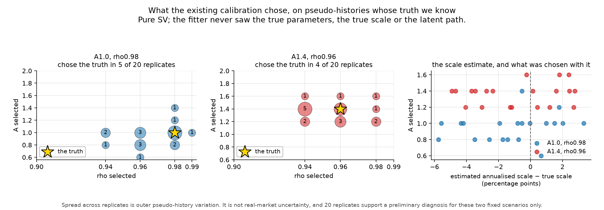
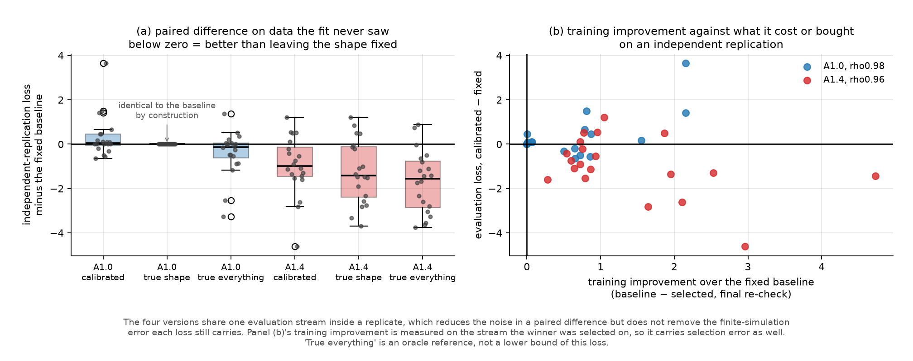

# Calibration recovery — is the procedure sound when the truth is known?

pure SV only. No jumps, no leverage term, no monitor, no market data. 40 fits: 20 independent pseudo-histories for each of two true parameter settings, each 1,258 days, with an independent 1,258-day replication from the same DGP for scoring. True annualised scale 0.192 — a DESIGN value for this simulation study, not an estimate from any market. Wall time 524s.

**the evaluation series is an INDEPENDENT REPLICATION from the same DGP, drawn on its own stream. It is not a continuation conditioned on the training period's end state, and nothing here is a conditional forecast.**

The protocol was written before the run and the existing procedure was checked against its description first: the 8 targets, their transforms, the two equal-weight groups, the baseline-reference scale rule, the 40-cell grid, 400-path screening and the top-3 plus fixed baseline 2000-path re-check. Verified against the code, 13 of 13 descriptions matched.


## 1. Parameter recovery



Two different things were conflated in the first write-up and are now separate. A cell can be **screened into the top three**, or it can be **actually scored in the final re-check** — and the fixed baseline is appended to the candidate set whenever the screen has not already produced it, so in the scenario where the truth *is* the baseline it was scored every time whatever its screening rank.

| scenario | truth | chose the truth | median A | median rho | truth's median screening rank | truth in the screened top 3 | truth ACTUALLY scored | on a grid edge |
|---|---|---|---|---|---|---|---|---|
| A1.0_rho0.98 | A=1, rho=0.98 | **5 of 20** | 1 | 0.97 | 7 of 40 | 9 of 20 | **20 of 20** | 2 of 20 |
| A1.4_rho0.96 | A=1.4, rho=0.96 | **4 of 20** | 1.4 | 0.96 | 3 of 40 | 11 of 20 | **11 of 20** | 0 of 20 |

Selection error against the truth, over the 20 pseudo-histories:

| scenario | quantity | mean error | its Monte-Carlo s.e. | median error | RMSE |
|---|---|---|---|---|---|
| A1.0_rho0.98 | A | -0.0500 | 0.0380 | +0.0000 | 0.1732 |
| A1.0_rho0.98 | rho | -0.0125 | 0.0035 | -0.0100 | 0.0196 |
| A1.0_rho0.98 | sigma_annual | -0.0117 | 0.0057 | -0.0078 | 0.0276 |
| A1.4_rho0.96 | A | -0.0400 | 0.0311 | +0.0000 | 0.1414 |
| A1.4_rho0.96 | rho | -0.0040 | 0.0034 | +0.0000 | 0.0155 |
| A1.4_rho0.96 | sigma_annual | -0.0081 | 0.0060 | -0.0071 | 0.0272 |

On the scale estimate specifically: the mean error is -0.0117 and -0.0081 in annualised decimal terms (-1.17 and -0.81 percentage points), each with a Monte-Carlo standard error of about 0.0058, and an RMSE of 0.0276 and 0.0272. That is the measurement; whether a scale error of this size matters for the loss is not settled by this experiment and no claim is made either way.

Every 2.5–97.5% figure here is an **empirical range across 20 simulated pseudo-histories under a known DGP**. It is not a confidence interval for any real-market parameter.


## 2. Distribution recovery on the independent replication



All differences below are **paired**, computed replicate by replicate and then summarised. The median of the paired differences is not the difference of the two medians, and both are shown so the gap is visible.

**J, the fitted objective on the independent replication**

| scenario | comparison | paired mean | its MC s.e. | paired median | difference of the two medians | better | tied | worse |
|---|---|---|---|---|---|---|---|---|
| A1.0_rho0.98 | selected - fixed_baseline | +0.3199 | 0.2148 | +0.0413 | +0.1944 | 5 | 5 | 10 |
| A1.0_rho0.98 | true_shape - fixed_baseline | +0.0000 | 0.0000 | +0.0000 | +0.0000 | 0 | 20 | 0 |
| A1.0_rho0.98 | true_everything - true_shape | -0.4064 | 0.2289 | -0.1268 | -0.1455 | 12 | 0 | 8 |
| A1.0_rho0.98 | true_everything - fixed_baseline | -0.4064 | 0.2289 | -0.1268 | -0.1455 | 12 | 0 | 8 |
| A1.4_rho0.96 | selected - fixed_baseline | -0.9677 | 0.3005 | -0.9933 | -0.8929 | 15 | 0 | 5 |
| A1.4_rho0.96 | true_shape - fixed_baseline | -1.2320 | 0.3196 | -1.4102 | -1.2634 | 16 | 0 | 4 |
| A1.4_rho0.96 | true_everything - true_shape | -0.4597 | 0.1901 | -0.4467 | -0.2576 | 12 | 0 | 8 |
| A1.4_rho0.96 | true_everything - fixed_baseline | -1.6918 | 0.3140 | -1.5522 | -1.5210 | 18 | 0 | 2 |

**the secondary energy score**

| scenario | comparison | paired mean | its MC s.e. | paired median | difference of the two medians | better | tied | worse |
|---|---|---|---|---|---|---|---|---|
| A1.0_rho0.98 | selected - fixed_baseline | +0.3442 | 0.1757 | +0.0369 | +0.3109 | 5 | 5 | 10 |
| A1.0_rho0.98 | true_shape - fixed_baseline | +0.0000 | 0.0000 | +0.0000 | +0.0000 | 0 | 20 | 0 |
| A1.0_rho0.98 | true_everything - true_shape | -0.2726 | 0.1630 | -0.1113 | -0.0896 | 12 | 0 | 8 |
| A1.0_rho0.98 | true_everything - fixed_baseline | -0.2726 | 0.1630 | -0.1113 | -0.0896 | 12 | 0 | 8 |
| A1.4_rho0.96 | selected - fixed_baseline | -0.7425 | 0.2114 | -0.6135 | -0.6773 | 17 | 0 | 3 |
| A1.4_rho0.96 | true_shape - fixed_baseline | -1.0631 | 0.2226 | -1.3603 | -1.1643 | 18 | 0 | 2 |
| A1.4_rho0.96 | true_everything - true_shape | -0.3034 | 0.1282 | -0.3309 | -0.1404 | 12 | 0 | 8 |
| A1.4_rho0.96 | true_everything - fixed_baseline | -1.3666 | 0.2227 | -1.4135 | -1.3047 | 18 | 0 | 2 |

The four versions share one evaluation stream inside a replicate. Common random numbers **reduce the noise of the paired comparison**; they do not remove the finite simulation error, which is why every paired mean above carries its own Monte-Carlo standard error. **the true A, rho AND the true scale -- an ORACLE REFERENCE, not a lower bound of the loss: the objective matches simulated medians to one sample and nothing makes the truth minimise it at n = 1258**

About the energy score: it uses **the same transform and the same standardisation as J** — log for the three realised-volatility quantiles, raw for the five autocorrelations, each divided by the same reference scale — but **not J's two-group weighting**. J gives each volatility target 1/6 and each autocorrelation target 1/10; the energy score weights all eight equally at 1/8. That was its pre-set definition and it has not been changed after seeing the results. It evaluates the joint distribution of the eight-statistic summary only; it does not verify the full return process. Where it disagrees with J the disagreement is left standing.


## 3. The unfitted diagnostics

Five statistics that took no part in the objective, reported per item rather than summarised into a verdict. 'Inside' counts how often the replication's own value fell in the simulated 2.5–97.5% range; the raw error is the simulated median minus that value, in the statistic's own units.

**A1.0_rho0.98**

| statistic | fixed_baseline inside / mean raw err | selected inside / mean raw err | true_shape inside / mean raw err | true_everything inside / mean raw err |
|---|---|---|---|---|
| `tail_below_m3_count` | 20/20, +1.050 | 20/20, +0.450 | 20/20, +1.050 | 20/20, +1.050 |
| `tail_above_p3_count` | 20/20, +0.200 | 19/20, -0.450 | 20/20, +0.200 | 20/20, +0.200 |
| `acf_sqret_lag1` | 19/20, -0.000 | 20/20, -0.011 | 19/20, -0.000 | 19/20, -0.000 |
| `acf_sqret_lag5` | 20/20, +0.030 | 20/20, +0.011 | 20/20, +0.030 | 20/20, +0.030 |
| `acf_sqret_lag21` | 20/20, -0.010 | 17/20, -0.035 | 20/20, -0.010 | 20/20, -0.010 |

**A1.4_rho0.96**

| statistic | fixed_baseline inside / mean raw err | selected inside / mean raw err | true_shape inside / mean raw err | true_everything inside / mean raw err |
|---|---|---|---|---|
| `tail_below_m3_count` | 19/20, -2.700 | 19/20, +0.000 | 19/20, +0.300 | 19/20, +0.300 |
| `tail_above_p3_count` | 18/20, -2.500 | 20/20, +0.200 | 20/20, +0.500 | 20/20, +0.500 |
| `acf_sqret_lag1` | 19/20, -0.042 | 20/20, +0.003 | 20/20, +0.010 | 20/20, +0.010 |
| `acf_sqret_lag5` | 18/20, -0.017 | 18/20, -0.018 | 20/20, -0.011 | 20/20, -0.011 |
| `acf_sqret_lag21` | 16/20, +0.042 | 17/20, -0.003 | 19/20, -0.003 | 19/20, -0.003 |


## 4. The four questions

**Does calibrating hurt an independent sample when the baseline is already right?** In the scenario where the truth *is* the fixed baseline, the paired difference has mean **+0.320** with a Monte-Carlo standard error of 0.215 and median +0.041: **5 better, 5 tied, 10 worse** out of 20. The ties are the replicates in which the calibration selected the baseline itself. The direction is towards a cost, and the mean is about 1.5 standard errors from zero — suggestive at this budget, not established.

**Does calibrating help when the baseline is biased?** Paired mean **-0.968** (s.e. 0.300), median -0.993, better in 15 of 20. Knowing the true shape instead gives a paired mean of **-1.232** (s.e. 0.320). Both are negative and the calibrated figure is the smaller of the two in magnitude; the ratio between them is **not** quoted, because dividing two means with standard errors of this size does not produce a supportable number.

The energy score agrees in sign and is somewhat more favourable to calibrating in this scenario (17 of 20 better against 15 on J). It carries different weights and evaluates only the eight-statistic summary, so the two are not interchangeable.

**Does unstable parameter selection mean the generated distribution is unstable?** This experiment does not answer that. What it can report is that the selection moves across pseudo-histories — the exact truth was chosen in 5 and 4 of 20 — while the paired evaluation differences above stay modest in the first scenario. Reading that as evidence that the distribution is stable, or that the parameters are unidentifiable, would require a common yardstick for the two spreads, which this design does not provide. The fixed-history check in the companion run isolates one component and is reported in `market_sensitivity_report.md`: at four fixed pseudo-histories, reseeding only the screening and finalist streams moved the selection in none of twenty fits, so at those histories the internal simulation draw is not what moved the choice. What did move it is not identified.

**What could explain the real-market pattern — better training, worse afterwards?** This design produces a cost from calibrating **with the mechanism held completely fixed**: in the first scenario the paired difference is +0.320 on average with the truth unchanged between the training and the evaluation series. So selection under a correct baseline is one candidate explanation. Whether it accounts for the size of the stage-3 and stage-4 reversals is **not** something this experiment can say: those came from a different design, on real data whose own statistics moved between the periods, and the two were never put on a common footing. The comparison of magnitudes made in the earlier write-up is withdrawn.


## 4b. What kind of problem is this?

| candidate | what the evidence supports |
|---|---|
| an implementation error | **not found**: 13 of 13 protocol descriptions match the code, the streams are separately addressed, the fitter has no parameter through which the truth could arrive, and the baseline and the fitted shape share one estimated scale |
| the screen not carrying the truth forward | **observed**: the truth reached the screened top three in 9 and 11 of 20. Whether that is screening noise specifically, as opposed to the objective not ranking the truth first, is **not separated by this design** |
| limited parameter identification | **consistent with** the selection spread, but not established: no reference scale for 'how much movement is too much' was fixed in advance |
| a scoring-criterion problem | **cannot be ruled out**: the objective matches simulated medians to one sample, so the truth is not guaranteed to minimise it. The oracle rows show how far the truth itself sits from the baseline |
| currently indistinguishable | the last three are not separated by this design |


## 5. Scope

- **inner simulation error** — how much a reported loss moves if the same configuration is simulated again; quantified as loss_mc_se
- **outer pseudo history variation** — how much the answer moves across the 20 pseudo-histories; this is what the outer spread shows
- **real market uncertainty** — NOT addressed here at all. These are simulated histories from a known DGP.
- a preliminary diagnosis for these two fixed scenarios. It is not a confidence statement about the S&P 500 or about any future period.


## 6. Reproducing

```bash
.venv/bin/python -m strategy_survivorship.run_market_recovery --timing
.venv/bin/python -m strategy_survivorship.run_market_recovery
.venv/bin/python -m strategy_survivorship.report_market_recovery
.venv/bin/python -m pytest tests/test_market_recovery.py -q
```
