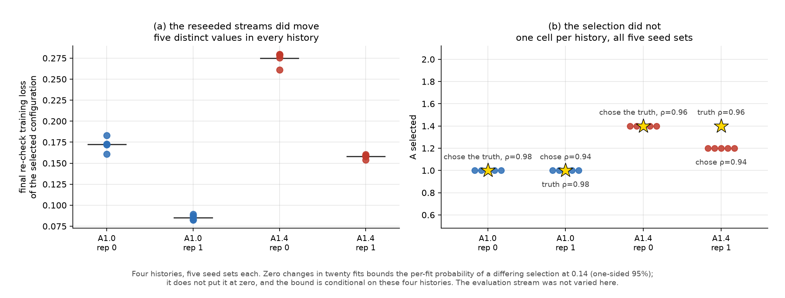

# Internal-simulation sensitivity at a fixed pseudo-history

Generated from the saved artefacts of the sensitivity run. No simulation is re-run to produce this file.

## What was varied and what was held

- **Question.** holding the pseudo-history and every weight fixed, how much does the selection move when only the internal simulation seeds change?
- **Held fixed inside a history.** the pseudo-training returns, the training scale estimate, the calibration reference weights, the pseudo-evaluation returns, the evaluation reference weights, the evaluation simulation stream.
- **Varied.** the screening stream and the finalist stream only, five independent seed sets.
- **Histories.** replicates 0 and 1 of each scenario, chosen BY INDEX before the check was run and not by how they performed.
- **Budget.** 5 seed sets on each of 4 histories = 20 fits, fixed before the run. stop at twenty fits. No extra runs to obtain a stabler or more decisive answer.
- **Not claimed.** twenty fits on four histories are NOT twenty independent market histories, and this design does NOT decompose the total error into its sources. It isolates internal simulation noise at a fixed history and nothing else.

## Result, per history

| history | truth | selections across the 5 seed sets | selected | true screen rank | eval J, calibrated − fixed | eval ES, calibrated − fixed |
|---|---|---|---|---|---|---|
| A1.0_rho0.98 rep 0 | A=1.0, ρ=0.98 | **1** distinct | A=1.0, ρ=0.98 (yes) | 1 | +0.000 | +0.000 |
| A1.0_rho0.98 rep 1 | A=1.0, ρ=0.98 | **1** distinct | A=1.0, ρ=0.94 (no) | 11 | -0.644 | -0.137 |
| A1.4_rho0.96 rep 0 | A=1.4, ρ=0.96 | **1** distinct | A=1.4, ρ=0.96 (yes) | 1–2 | +1.217 | +0.962 |
| A1.4_rho0.96 rep 1 | A=1.4, ρ=0.96 | **1** distinct | A=1.2, ρ=0.94 (no) | 9–10 | -1.122 | -0.628 |

The two evaluation columns show a single value per history rather than a range because the selection did not move and the evaluation stream was held fixed; the identical numbers are a consequence of that, not a separate finding.

## Evidence that the seeds really did move

A check that returns 'nothing changed' is worth nothing unless the varied streams demonstrably varied. Two fields confirm they did.

| history | distinct final re-check training losses (of 5) | spread | true screen rank |
|---|---|---|---|
| A1.0_rho0.98 rep 0 | 5 | 0.1611–0.1832 (sd 7.83e-03) | stable at 1 |
| A1.0_rho0.98 rep 1 | 5 | 0.0824–0.0891 (sd 2.86e-03) | stable at 11 |
| A1.4_rho0.96 rep 0 | 5 | 0.2612–0.2796 (sd 7.74e-03) | moved: 1/2 |
| A1.4_rho0.96 rep 1 | 5 | 0.1541–0.1602 (sd 2.32e-03) | moved: 9/10 |

Every history produced five distinct training losses, and in two of the four the truth's position in the screen moved between seed sets. The streams are wired through; the selection simply did not follow them.

## What the four histories say

The selection changed in **0 of 4** histories when only the screening and finalist streams were reseeded. Across all 20 fits the chosen cell was constant within its history.

Two of the four histories selected something other than the truth, and did so **identically under all five seed sets**:

- `A1.0_rho0.98` rep 1: truth A=1.0, ρ=0.98; chosen A=1.0, ρ=0.94 five times out of five, with the truth ranked 11 in the screen.
- `A1.4_rho0.96` rep 1: truth A=1.4, ρ=0.96; chosen A=1.2, ρ=0.94 five times out of five, with the truth ranked 9–10 in the screen.

For those histories the miss is a property of the drawn pseudo-training sample under this objective, not of the internal simulation draw. That is the single thing this check establishes.

## The limits of this check

- Zero changes in 20 fits does not mean the probability of a change is zero. Treating the five seed sets within a history as independent given that history, the one-sided 95% upper bound on the per-fit probability of a differing selection is **0.14**. A reseeding effect smaller than that is entirely compatible with what was observed.
- The bound is conditional on **these four histories**. They were picked by index before the run, but four is four; a history sitting between two grid cells could behave differently.
- The check varies the screening and finalist streams. It does **not** vary the evaluation stream, so it says nothing about how much the evaluation losses themselves would move.
- Twenty fits on four histories are not twenty market histories, and this design does **not** decompose the total selection error into sources. It bounds one component at a fixed history and leaves the rest unmeasured.

## How this bears on the recovery experiment

The recovery experiment's selections moved across its twenty pseudo-histories. This check shows that at four of those histories the internal simulation draw was not what moved them, within the resolution stated above. It does **not** identify what did: the drawn training sample, the objective's ranking of the grid, and the screen-then-rescore rule are still not separated from one another.

---

Run: 20 fits in 193 s. Code identity `?`. Written 2026-09-14T03:05:53.280892+00:00.
Artefacts: `market_sensitivity_protocol.json`, `market_sensitivity_results.csv`, `market_sensitivity_summary.json`, `market_sensitivity_seed_sets.png`.
