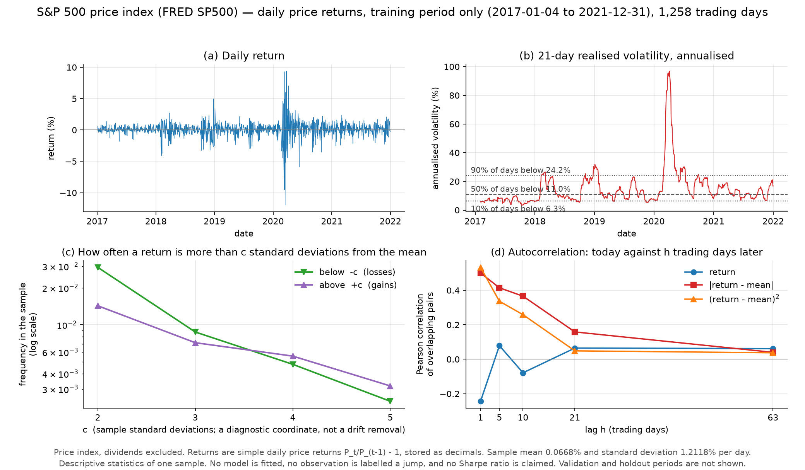

# Real-data reference, stage 1 — S&P 500 daily price returns

Protocol: [`docs/MARKET_STAGE1_PROTOCOL.md`](../../docs/MARKET_STAGE1_PROTOCOL.md), written before any diagnostic below existed.

**No simulation comparison has been run in this stage.** Nothing here says whether the generator matches or fails to match the market; that is stage 2.


## 1. What the data is

- Series: **SP500** — Federal Reserve Bank of St. Louis (FRED); index by S&P Dow Jones Indices LLC
- Page: https://fred.stlouisfed.org/series/SP500
- Units: index level, points (S&P 500 PRICE index; dividends excluded)
- Downloaded: `2026-09-13T03:11:58.805936+00:00`; raw file `data/raw/SP500_20260913T031157Z.csv`
- Raw SHA-256: `7f08dc75562f523eb5f934b380b30fb8c005629babd5835c566bbb40bedbdf47`
- File covers 2016-09-12 to 2026-09-11, 2514 rows with a value

This is a **price** index: dividends are excluded. It is used only to study the shape of daily return noise. It is **not** a strategy return series, not an effective-strategy sample, not a total-return or excess-return series, and nothing here estimates or implies a Sharpe ratio for it.

Auxiliary: **VIXCLS** from Federal Reserve Bank of St. Louis (FRED); index by Cboe, 2289 rows in the window, raw SHA-256 `1a13cfab725900bd492fde9f666599a26279a52733a8b2173ca031e3217af5e7`. Units: annualised implied volatility in PERCENT: a level of 20 means about 20% annualised implied volatility, NOT a 20% return. It looks forward about 30 calendar days, while RV_21 looks back over 21 trading days, so the two are not expected to agree point by point.

## 2. Measurement conventions

- Return: `r_t = P_t / P_(t-1) - 1, stored as a decimal, formed only between consecutive trading days; no risk-free rate is subtracted`
- Window: 2017-01-01 to 2025-12-31
- Split (research design, **not** a claim of independence or identical distribution across periods):

| period | dates | returns | used this stage |
|---|---|---|---|
| training | 2017-01-01 – 2021-12-31 | 1,258 | diagnosed |
| validation | 2022-01-01 – 2023-12-31 | 501 | **not opened** |
| holdout_test | 2024-01-01 – 2025-12-31 | 502 | **not opened** |

- Realised volatility: RV_21 = sqrt(252) * std(r_{t-20..t}), ddof=1, complete windows only; an estimate from past returns, not an observable latent variance
- Moments: mean, sd (ddof=1), skewness g1 = m3/m2^1.5, excess kurtosis g2 = m4/m2^2 - 3 (plain moment estimators); RV_21 quantiles 10/50/90 by linear interpolation
- Sample bounds: every statistic is computed by a function that takes explicit bounds; a rolling window or a lagged pair never crosses a period boundary, so RV_21 starts on the 21st trading day of the period

## 3. File checks (whole span, not just the training period)

- Trading days the NYSE calendar expects: **2,262**; days with a price in the file: **2,262**
- Blank weekday rows: **86**, of which **86** fall on a calendar holiday
- Blanks on a day the calendar says the market was open: **0**
- Weekday rows missing from the file entirely: **0**
- Duplicate dates: **0**; non-positive prices: **0**; out of order: **False**
- Coverage requested 2017-01-01..2025-12-31, available 2017-01-03..2025-12-31 — covers the request: **True**
- Returns spanning a missing trading day: **0** out of 2,261 (every step is one trading day)

Defects found: **none**. Nothing was filled, forward-filled, winsorised, deleted or smoothed.

## 4. Training period, 2017-01-04 to 2021-12-31

1,258 daily returns.

| statistic | value |
|---|---|
| mean return | 0.0668% per day |
| standard deviation (ddof=1) | 1.2118% per day |
| skewness | -0.739 |
| excess kurtosis | 20.37 |
| most negative return | -11.98% |
| most positive return | 9.38% |
| RV(21) annualised, 10% quantile | 6.3% |
| RV(21) annualised, median | 11.0% |
| RV(21) annualised, 90% quantile | 24.2% |
| RV(21) values (complete windows) | 1,238, first on 2017-02-02 |

The mean above is a **sample mean of a price index**. It is not an edge, not an excess return and not a Sharpe estimate, and nothing downstream may use it as one.

### Tail frequencies

`z = (r - mean) / sd` with the training mean and standard deviation. This standardisation is a **diagnostic coordinate**: it does not remove a true drift, does not reveal a true Sharpe ratio and does not produce a labelled generator.

| c | share below −c | share above +c | count below | count above |
|---|---|---|---|---|
| 2 | 2.941% | 1.431% | 37 | 18 |
| 3 | 0.874% | 0.715% | 11 | 9 |
| 4 | 0.477% | 0.556% | 6 | 7 |
| 5 | 0.238% | 0.318% | 3 | 4 |

For reference, a normal distribution would put about 4.55%, 0.270%, 0.0063% and 0.000057% of its mass outside ±2, ±3, ±4 and ±5 standard deviations, i.e. roughly half of those on each side. That comparison is a reading aid, not a test.

### Time dependence

Pearson correlation of the overlapping pairs; each lag uses its own `n − h` pairs, both members inside the training period.

| lag (trading days) | return | \|return − mean\| | (return − mean)² |
|---|---|---|---|
| 1 | -0.244 | +0.501 | +0.533 |
| 5 | +0.079 | +0.415 | +0.336 |
| 10 | -0.079 | +0.366 | +0.259 |
| 21 | +0.065 | +0.158 | +0.049 |
| 63 | +0.062 | +0.040 | +0.037 |

Return against the **future** squared return, `corr(r_t, (r_{t+h} − mean)²)`:

| h (trading days) | correlation | pairs |
|---|---|---|
| 1 | -0.095 | 1,257 |
| 5 | -0.068 | 1,253 |
| 21 | -0.051 | 1,237 |

These are descriptive statistics of one finite sample. No significance test was run, and none of these numbers is being announced as a mechanism.

### The largest moves, checked and kept

Every extreme was checked against the source rather than trimmed. All ten span exactly one trading day, so none is an artefact of a missing day, and none is labelled a "true jump".

| date | previous close | close | return | z |
|---|---|---|---|---|
| 2020-03-16 | 2,711.02 | 2,386.13 | -11.98% | -9.9 |
| 2020-03-12 | 2,741.38 | 2,480.64 | -9.51% | -7.9 |
| 2020-03-24 | 2,237.40 | 2,447.33 | +9.38% | +7.7 |
| 2020-03-13 | 2,480.64 | 2,711.02 | +9.29% | +7.6 |
| 2020-03-09 | 2,972.37 | 2,746.56 | -7.60% | -6.3 |
| 2020-04-06 | 2,488.65 | 2,663.68 | +7.03% | +5.7 |

All ten of the largest absolute moves fall between 2020-03-09 and 2020-06-11.

## 5. Figure



Daily returns, 21-day annualised realised volatility, tail frequencies on both sides, and autocorrelation of the return, the centred absolute return and the centred squared return. Training period only.

## 6. Is this enough to go to stage 2?

**Yes for the noise-shape work, with the limits below.** The series covers the requested window exactly, every expected trading day is present, no value is imputed, and the diagnostics are produced by functions that take explicit sample bounds — the same functions stage 2 will call on simulated paths, so the two will be measured identically.

It is **not** enough for anything that needs a labelled strategy. One price index gives one realisation of one asset. It cannot identify a cross-strategy parameter distribution, it carries no true Sharpe label, and this stage did not fit anything to it.

## 7. Reproducing

```bash
.venv/bin/python -m strategy_survivorship.run_market_stage1
.venv/bin/python -m strategy_survivorship.run_market_stage1 --reuse-snapshot
.venv/bin/python -m strategy_survivorship.report_market_stage1
.venv/bin/python -m pytest tests/test_market_stage1.py -q
```

`--reuse-snapshot` re-runs everything from the local raw file, which is the file of record: FRED's `SP500` keeps only a rolling ten-year window, so a download made later will not contain the earliest dates of this study. The raw snapshot and every per-day derived file are tracked in this repository by the owner's explicit decision, although FRED states the S&P 500 data comes from S&P Dow Jones Indices and may not be redistributed.
