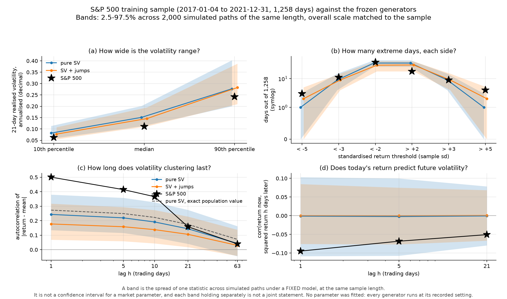

# Market stage 2 — the frozen generators against the S&P 500 training sample

A diagnostic contrast. **No parameter was searched or fitted**, no monitor was touched, no earlier stage was re-run, and the validation and holdout periods were not opened.

Code: commit `4b84506` plus the uncommitted `mixed_noise` and market work already in the tree. 2,000 paths x 1,258 days per cell, 5 generators x 2 scale settings. Root entropy `20260913`; `STREAM_ORDER` was **not** modified, so every earlier stage stays bit-identical.


## 1. Corrections to the stage-1 reading

Four statements from stage 1 were too strong or simply wrong. Each correction below is backed by a number.

**(a) The ±5 sd tails rest on 3 and 4 observations** out of 1,258. That is far too few to describe the far tail as symmetric or asymmetric either way. Stage 1 quoted the frequencies without the counts; the counts are now reported alongside every tail frequency.

**(b) The SV generator's returns are not iid, but they carry no linear autocorrelation.** Stage 1 called the market's lag-1 return autocorrelation a departure "from the generator's iid setting". The generator is not iid — it has volatility dependence. What it does have is a population linear autocorrelation of the centred return of zero: a 1,500 x 3,000 Monte Carlo gives +0.0007, -0.0006 and -0.0001 at lags 1, 5 and 21. The correct statement is that the market shows linear return dependence and the generator has none.

**(c) The absolute-return ACF decay is not read off `rho`.** Stage 1 reasoned from a half-life of the latent AR(1) to an expected decay of the absolute-return ACF. That step is wrong. The repository already contains the exact population formula, `noise.stoch_vol_abs_eps_autocorr`, and it was verified here against a Monte Carlo before use:

| lag | pure-SV exact population value | Monte Carlo | S&P 500 (full training) |
|---|---|---|---|
| 1 | 0.2730 | 0.2738 | 0.5007 |
| 5 | 0.2493 | 0.2503 | 0.4146 |
| 10 | 0.2229 | 0.2238 | 0.3660 |
| 21 | 0.1747 | 0.1753 | 0.1584 |
| 63 | 0.0713 | 0.0724 | 0.0400 |

So the pure-SV model is **too flat**, not too slow: it starts far below the sample at lag 1 and ends above it at lag 63. That is a shape mismatch, and it is the opposite of what stage 1 predicted.

**(d) Clustered extreme returns are not identified clustered jumps.** The concentration of the largest moves in 2020 is a statement about realised returns. Latent jumps are not observable in this data, and nothing here separates a jump from a high-variance day.

### The lag-1 return autocorrelation, re-checked

Alignment: every adjacent pair really shares a trading day (`prev_date[t] == date[t-1]` for all 1,258 returns): **True**. Three definitions agree:

| definition | value |
|---|---|
| pearson on overlapping pairs | -0.24397 |
| full sample mean over sum of squares | -0.24395 |
| numpy corrcoef | -0.24397 |

Where the covariance comes from. Each row is the sum of `(r_t - rbar)(r_{t+1} - rbar)` over pairs whose later day falls in that year:

| year | pairs | sum of products | share of the total | share of the absolute contribution |
|---|---|---|---|---|
| 2017 | 249 | -5.757e-04 | +1.3% | 1.8% |
| 2018 | 251 | +1.124e-04 | -0.2% | 14.4% |
| 2019 | 252 | -1.367e-03 | +3.0% | 7.3% |
| 2020 | 253 | -4.182e-02 | +92.9% | 67.3% |
| 2021 | 252 | -1.379e-03 | +3.1% | 9.3% |

**March 2020 alone — 22 pairs — supplies 84.3% of the total.** The estimate is not an artefact of alignment or definition; it is an artefact of one quarter.

Three contiguous calendar blocks. Pairs straddling a boundary belong to neither block and are simply not formed: **no date is spliced, the crisis is not removed, and the main training sample is unchanged**.

| segment | returns | daily sd | skewness | excess kurtosis | ACF r lag 1 | ACF \|r\| lag 1 | ACF \|r\| lag 21 | RV21 median |
|---|---|---|---|---|---|---|---|---|
| 2017-2019 | 753 | 0.806% | -0.62 | 5.42 | -0.038 | +0.281 | +0.069 | 8.8% |
| 2020 | 253 | 2.169% | -0.55 | 7.85 | -0.353 | +0.524 | +0.047 | 21.6% |
| 2021 | 252 | 0.825% | -0.34 | 0.66 | -0.078 | +0.238 | -0.032 | 11.8% |
| full training | 1,258 | 1.212% | -0.74 | 20.37 | -0.244 | +0.501 | +0.158 | 11.0% |

Two things follow. The lag-1 return autocorrelation is an order of magnitude weaker outside 2020. And the full-sample statistics are **not** a smooth summary of the parts: full-sample excess kurtosis (20.37) exceeds every block, and the full-sample |return| ACF at lag 1 (0.501) exceeds two of the three blocks. Pooling a calm regime with 2020 inflates both.


## 2. The contrast protocol, recorded before the Monte Carlo

- Real sample: FRED SP500 daily closing PRICE index, dividends excluded, 2017-01-01 to 2021-12-31, 1,258 returns. Not read: validation 2022-2023, holdout test 2024-2025.
- Generators (data-generating models, **not** monitors): **Gaussian** — iid normal; **Student-t** — standardised iid Student-t, nu = 5; **pure SV** — log-variance AR(1), rho = 0.98, amplitude A = 1, no jumps; **jumps only** — iid normal + compound Poisson, lambda = 2/yr, kappa = 5; **SV + jumps** — both together, same parameters.
- the single-parameter models are compared one by one. A mixture over random (A, kappa) is NOT used here: it would hide a single-parameter model's misfit behind population spread, and one S&P history cannot identify a cross-strategy parameter distribution anyway.
- Scales: **native** sigma_annual = 0.1000 (the project's standing setting, not fitted); **matched** sigma_annual = 0.1924 (sd(S&P training returns) * sqrt(252); an ESTIMATE from the training sample, scale only). The matched setting the overall scale ONLY; rho, A, nu, lambda and kappa are untouched.
- Simulation at Sharpe 0: a pure noise comparison; the market's sample mean is not treated as an edge and no drift is fitted.
- Concentration statistic, fixed before the run: largest count of |z| > 3 inside any 63 consecutive trading days; the same rule for the market and for every path, fixed before the run.
- Aggregation: non-overlapping h-day SIMPLE returns, prod(1+r) - 1, for h = 1, 5, 21 -- the definition consistent with the daily simple-return convention.

What was deliberately not done:

- no simulated path is rescaled after the draw to hit a target moment
- paths are never concatenated into one long series to measure dependence
- a per-statistic simulated range is NOT a confidence interval for a market parameter and NOT a joint statement across statistics
- no significance test, no pass/fail score, no weighted total
- vol-state tail diagnostics, if added later, must use a volatility estimate through the PREVIOUS day; RV_21 including the day itself cannot show that the day's own extreme return was 'explained'

## 3. The gap table

Matched scale. Each cell is the simulated median with the 2.5–97.5% range across paths; **out** marks a real value outside that range. A range is the spread of one statistic under a fixed model — not a confidence interval for a market parameter, and not a joint statement across rows.

| statistic | S&P 500 | Gaussian | Student-t | pure SV | jumps only | SV + jumps |
|---|---|---|---|---|---|---|
| daily sd | 0.0121 | 0.0121 [0.0116, 0.0126] | 0.0121 [0.0113, 0.0131] | 0.0119 [0.0089, 0.0163] | 0.0121 [0.0111, 0.0134] | 0.0118 [0.0091, 0.0156] |
| RV21 10th pct | 0.063 | 0.152 [0.143, 0.161] **out** | 0.137 [0.127, 0.147] **out** | 0.082 [0.057, 0.114] | 0.141 [0.131, 0.149] **out** | 0.077 [0.055, 0.108] |
| RV21 median | 0.110 | 0.189 [0.181, 0.197] **out** | 0.181 [0.170, 0.192] **out** | 0.151 [0.112, 0.202] **out** | 0.177 [0.168, 0.185] **out** | 0.146 [0.112, 0.195] **out** |
| RV21 90th pct | 0.242 | 0.229 [0.218, 0.241] **out** | 0.242 [0.221, 0.268] | 0.277 [0.200, 0.403] | 0.227 [0.208, 0.282] | 0.282 [0.210, 0.388] |
| skewness | -0.74 | -0.00 [-0.13, +0.14] **out** | +0.00 [-0.95, +0.88] | -0.01 [-0.63, +0.55] **out** | -0.03 [-1.80, +1.60] | +0.03 [-2.21, +2.22] |
| excess kurtosis | 20.4 | -0.0 [-0.2, 0.3] **out** | 3.1 [1.3, 18.0] **out** | 3.1 [1.2, 10.4] **out** | 7.0 [0.4, 29.0] | 10.2 [2.7, 45.6] |
| days < -2 sd | 37 | 28 [20, 37] | 31 [22, 40] | 35 [26, 44] | 22 [12, 32] **out** | 30 [18, 41] |
| days > +2 sd | 18 | 29 [20, 37] **out** | 31 [22, 40] **out** | 35 [26, 44] **out** | 21 [12, 32] | 30 [18, 40] |
| days < -3 sd | 11 | 2 [0, 4] **out** | 7 [3, 12] | 9 [4, 15] | 3 [1, 7] **out** | 9 [4, 15] |
| days > +3 sd | 9 | 2 [0, 4] **out** | 7 [3, 12] | 9 [4, 15] | 3 [0, 7] **out** | 9 [4, 15] |
| days < -5 sd | 3 | 0 [0, 0] **out** | 1 [0, 3] | 1 [0, 3] | 1 [0, 4] | 2 [0, 5] |
| days > +5 sd | 4 | 0 [0, 0] **out** | 1 [0, 3] **out** | 1 [0, 3] **out** | 1 [0, 4] | 2 [0, 5] |
| ACF return, lag 1 | -0.244 | -0.001 [-0.057, +0.053] **out** | +0.000 [-0.054, +0.054] **out** | -0.004 [-0.083, +0.078] **out** | -0.002 [-0.053, +0.056] **out** | +0.001 [-0.074, +0.071] **out** |
| ACF \|ret\|, lag 1 | +0.501 | -0.002 [-0.057, +0.055] **out** | -0.001 [-0.054, +0.057] **out** | +0.244 [+0.135, +0.380] **out** | -0.001 [-0.051, +0.053] **out** | +0.178 [+0.069, +0.318] **out** |
| ACF \|ret\|, lag 10 | +0.366 | -0.000 [-0.054, +0.056] **out** | -0.000 [-0.053, +0.054] **out** | +0.191 [+0.084, +0.328] **out** | -0.003 [-0.055, +0.050] **out** | +0.138 [+0.043, +0.274] **out** |
| ACF \|ret\|, lag 21 | +0.158 | -0.001 [-0.055, +0.054] **out** | -0.001 [-0.055, +0.058] **out** | +0.144 [+0.041, +0.275] | -0.001 [-0.050, +0.059] **out** | +0.106 [+0.018, +0.229] |
| ACF \|ret\|, lag 63 | +0.040 | -0.000 [-0.055, +0.057] | -0.001 [-0.054, +0.058] | +0.043 [-0.045, +0.162] | -0.002 [-0.053, +0.055] | +0.030 [-0.043, +0.138] |
| corr(r_t, r^2_{t+1}) | -0.095 | +0.000 [-0.053, +0.055] **out** | -0.001 [-0.056, +0.056] **out** | -0.001 [-0.108, +0.103] | -0.000 [-0.052, +0.051] **out** | +0.000 [-0.076, +0.085] **out** |
| corr(r_t, r^2_{t+21}) | -0.051 | +0.001 [-0.056, +0.057] | +0.000 [-0.058, +0.054] | -0.001 [-0.080, +0.078] | -0.001 [-0.056, +0.052] | +0.001 [-0.067, +0.068] |
| 5-day excess kurtosis | 5.93 | -0.05 [-0.51, 0.72] **out** | 0.54 [-0.24, 4.27] **out** | 2.45 [0.52, 10.33] | 1.12 [-0.25, 6.84] | 3.60 [0.95, 12.59] |
| 21-day excess kurtosis | 1.56 | -0.17 [-0.88, 1.50] **out** | -0.08 [-0.84, 1.97] | 1.29 [-0.34, 9.26] | 0.07 [-0.79, 2.73] | 1.21 [-0.32, 8.16] |
| max \|z\|>3 days in any 63 | 16 | 1 [0, 3] **out** | 3 [2, 5] **out** | 8 [3, 17] | 2 [1, 3] **out** | 6 [2, 14] **out** |

Counting how many of the 22 rows contain the real value gives Gaussian 4, Student-t 10, pure SV 14, jumps only 11, SV + jumps 16. **That count is a navigation aid, not a score and not a pass rate**: the rows are not independent, they are not equally important, and no weighting was designed.

### Scale separates cleanly from shape

At the native setting the generators produce a daily standard deviation of about 0.0062 against the sample's 0.0121 — the training period ran at roughly 19.2% annualised, not 10%. Changing only the overall scale moves every level statistic and leaves the shape verdicts alone: of 40 (statistic x generator) shape verdicts, **1** changes between the two scale settings. Scale is therefore a separate, and separately fixable, gap.

### Wasserstein-1 on standardised daily returns

Shape only, scale removed. The reference column is the distance between two independent simulated samples of the **same length** under the same model, which is what a finite sample costs even when the model is exactly right.

| generator | W1 to the S&P sample | simulation-to-simulation reference |
|---|---|---|
| Gaussian | 0.302 [0.283, 0.320] | 0.032 [0.020, 0.052] |
| Student-t | 0.207 [0.167, 0.241] | 0.045 [0.028, 0.085] |
| pure SV | 0.180 [0.103, 0.234] | 0.056 [0.029, 0.126] |
| jumps only | 0.248 [0.187, 0.294] | 0.052 [0.029, 0.121] |
| SV + jumps | 0.135 [0.078, 0.199] | 0.069 [0.036, 0.144] |

Every generator sits further from the sample than two of its own samples sit from each other, so none of them is indistinguishable from the market on daily shape. This distance ignores time ordering entirely and cannot replace the dependence rows above.


## 4. Figure




## 5. What kind of gap is each one?

### Mostly scale

- **Overall level.** The sample's daily sd is 0.0121 (19.2% annualised) against the project's 10% setting. Nothing about the shape depends on it, and matching it is one number.

### Possibly reachable with the parameters already in the model

- **The middle of the volatility distribution.** With the scale matched, the sample's *spread* of realised volatility is reproduced — the 90th/10th percentile ratio is 3.85 against pure SV's 3.38 [2.48, 5.28] — and both the 10th percentile (0.063 vs 0.082 [0.057, 0.114]) and the 90th (0.242 vs 0.277 [0.200, 0.403]) sit inside the simulated range. The **median** does not: 0.110 against 0.151 [0.112, 0.202]. The model's typical day is too volatile relative to its own tail. `A` and `rho` both move that shape, so this looks like a parameter question rather than a missing mechanism — but no search was run and this is not a claim that a setting exists.

- **Short-lag volatility clustering.** The sample's |return| ACF at lag 1 is 0.501 against pure SV's 0.244 [0.135, 0.380], and the exact population value at these parameters is 0.273. By lag 21 and lag 63 the sample is **inside** the simulated range. The model needs more clustering at short lags and less at long ones. `A` raises the whole curve and `rho` tilts it, so the direction is available inside the existing model.

### Structural, in the sense that no setting of the current parameters produces it

- **Linear autocorrelation of the return.** The sample gives -0.244 at lag 1. All five generators have a population value of exactly zero by construction, and their simulated ranges are centred on zero. No choice of `A`, `rho`, `nu`, `lambda` or `kappa` creates it. Adding it would be a new mechanism — and see the sample limits below before doing so.

### Currently limited by the sample, so not concludable either way

- **The return-to-future-volatility relation.** The sample gives -0.095 at h = 1, and the pure-SV simulated range at this sample length is [-0.108, +0.103] — which **contains** it, even though the model has no asymmetric mechanism at all. At 1,258 days this statistic cannot tell an asymmetric model from a symmetric one. **Nothing here says a leverage effect is needed.**

- **Skewness.** The sample gives -0.739. The SV+jump range is [-2.213, +2.220] from a model whose jumps are **symmetric**; a heavy-tailed symmetric model produces sample skewness of this size routinely. Sample skewness is not evidence of a structural asymmetry here.

- **Excess kurtosis.** The sample gives 20.4; the SV+jump range is [2.7, 45.6] and the jumps-only range also contains it. Kurtosis alone does not demand anything further, and its sampling spread at this length is enormous.

- **Concentration of extremes.** The sample's largest count of |z| > 3 days inside any 63 consecutive trading days is 16. Pure SV gives 8 [3, 17] and contains it; SV+jumps gives 6 [2, 14] and does not. Adding an independent jump on top of persistent volatility **spreads** extremes out rather than concentrating them, because at a fixed total variance the jump component makes ordinary days quieter. That is worth knowing before anyone assumes a jump term helps here.

### The sample limit that qualifies all of the above

One index, one realisation, 1,258 days, and one extraordinary quarter inside it. The subperiod table shows that the full-sample excess kurtosis, the full-sample |return| ACF at lag 1, and 93% of the lag-1 return covariance all depend on 2020. A generator judged against these targets is being judged against a sample dominated by one episode. This is a reason to treat the numbers as diagnostics rather than fitting targets — not a reason to remove the episode.


### Which knob moves which gap

`market_stage2_parameter_directions.csv` reads the **existing** population formula at other `(A, rho)`. **No simulation was run, nothing was selected, and no setting is being recommended as fitted** — it only shows the direction each parameter moves the two shape gaps, so the next round knows where to look.

| A | rho | SV ACF \|r\| lag 1 | lag 21 | lag 63 | ACF63/ACF1 | median volatility multiplier |
|---|---|---|---|---|---|---|
| 1.0 *(current)* | 0.98 | 0.273 | 0.175 | 0.071 | 0.261 | 0.779 |
| 1.0 | 0.96 | 0.267 | 0.110 | 0.019 | 0.071 | 0.779 |
| 1.0 | 0.94 | 0.260 | 0.069 | 0.005 | 0.019 | 0.779 |
| 1.2 | 0.98 | 0.338 | 0.212 | 0.085 | 0.251 | 0.698 |
| 1.2 | 0.96 | 0.330 | 0.132 | 0.022 | 0.068 | 0.698 |
| 1.2 | 0.94 | 0.322 | 0.082 | 0.006 | 0.018 | 0.698 |
| 1.4 | 0.98 | 0.394 | 0.242 | 0.094 | 0.239 | 0.613 |
| 1.4 | 0.96 | 0.384 | 0.148 | 0.024 | 0.064 | 0.613 |
| 1.4 | 0.94 | 0.374 | 0.091 | 0.006 | 0.017 | 0.613 |
| 1.6 | 0.98 | 0.441 | 0.263 | 0.099 | 0.225 | 0.527 |
| 1.6 | 0.96 | 0.429 | 0.158 | 0.025 | 0.059 | 0.527 |
| 1.6 | 0.94 | 0.417 | 0.096 | 0.007 | 0.016 | 0.527 |

Sample targets for the same quantities: lag 1 0.501, lag 21 0.158, lag 63 0.040, ratio 0.080, and a median RV21 of 0.574 times the unconditional annualised sd.

`A` raises the level of the whole clustering curve and, because `E[v] = 1` is enforced, simultaneously pushes the median volatility down relative to the unconditional sd. `rho` steepens the decay without moving the level. Both gaps therefore point the same way, which is the one useful thing this table says. It does **not** say a setting exists that closes them together.


## 6. Reproducing

```bash
.venv/bin/python -m strategy_survivorship.run_market_stage2 --paths 2000
.venv/bin/python -m strategy_survivorship.report_market_stage2
.venv/bin/python -m pytest tests/test_market_stage2.py -q
```

Per-path statistics are in `market_stage2_path_statistics.csv.gz`, so every median and range above can be recomputed without re-running the simulation. Seeds and the full configuration are in `market_stage2_summary.json`. As in stage 1, the market data and everything derived from it are tracked here; the providers' terms still apply, see docs/DATA_LICENCE_NOTICE.md.
