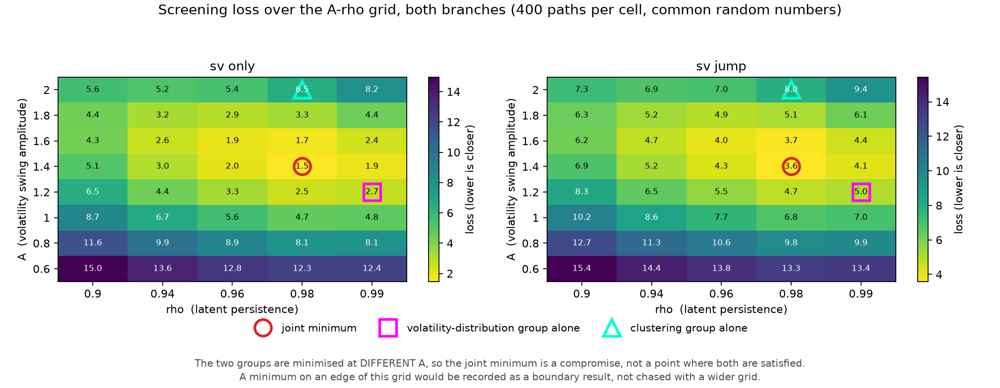
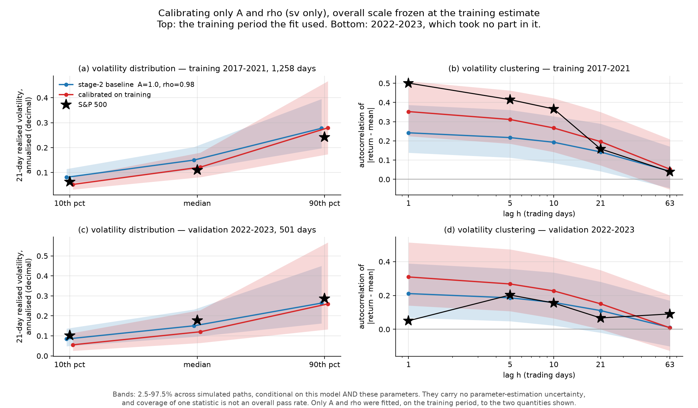

# Market stage 3 — calibrating A and rho, then freezing and checking

> **Correction notice.** Stage 4 corrected four statements in this write-up; no number below changed. The validation-length loss column is a POST-HOC supplementary analysis, not a pre-specified one: the smoke run had already printed validation losses before it was added. The attribution "the cause lies in the market itself" is withdrawn. Two held-out statistics for pure SV and four for SV+jumps had their simulated centre drift away from the sample while staying inside a widened band, which the boundary-crossing count below does not show. The claim that the two target groups cannot be satisfied together holds for THIS grid and THIS objective only. See `market_stage4_report.md` section 1 and `market_stage4_stage3_corrections.json`.

Only `A` and `rho` move. The overall scale is frozen at the training estimate, `kappa`, `lambda` and `nu` keep their recorded values, no monitor is touched, and the holdout period is not read.

Training 1,258 returns, validation 501 returns. Frozen `sigma_annual` = `0.1923686721294862` (19.2369%), from sd(S&P training returns) * sqrt(252), exact value.


## 1. Corrections to the stage-2 reading

**(a) `rho` does not move the stationary marginal of the latent variance, but it does move RV_21.** At `A = 1` the marginal of `v` is lognormal with quantiles 0.168 / 0.607 / 2.185 whatever `rho` is, and the simulation reproduces that. The RV_21 distribution still changes, because a 21-day average of a more persistent process is smoothed less:

| rho | v 10/50/90 (simulated) | RV21 10th | RV21 median | RV21 90th | RV21 90/10 |
|---|---|---|---|---|---|
| 0.90 | 0.168 / 0.606 / 2.175 | 0.0955 | 0.1623 | 0.2725 | 2.88 |
| 0.94 | 0.166 / 0.602 / 2.182 | 0.0879 | 0.1562 | 0.2744 | 3.09 |
| 0.96 | 0.169 / 0.612 / 2.199 | 0.0856 | 0.1545 | 0.2803 | 3.29 |
| 0.98 | 0.169 / 0.597 / 2.124 | 0.0823 | 0.1512 | 0.2689 | 3.25 |
| 0.99 | 0.160 / 0.581 / 2.125 | 0.0786 | 0.1444 | 0.2687 | 3.30 |

So `rho` is not a pure autocorrelation knob: it has to be judged on the realised-volatility distribution as well.

**(b) The latent instantaneous volatility median is not the RV_21 median**, and is never used as a target. The two are close at small `A` and separate as `A` grows — ratio 0.984 at A=0.6, 0.991 at A=1, 1.050 at A=1.4, 1.044 at A=1.8, 1.120 at A=2. Every realised-volatility number in this stage comes from the same `RV_21` function applied to the market and to every simulated path.

**(c) Scale invariance, measured on the same noise paths.** Holding the noise draw fixed and changing only `sigma_annual` by a factor of 1.9237: **38** statistics are numerically unchanged, **5** are exactly proportional to the scale (agg1d_sd, rv21_q10, rv21_q50, rv21_q90, sd_daily), and **6** genuinely differ — all of them compounded aggregates, because `prod(1+r) - 1` is not linear in `r`. A standardised single-day statistic is scale-free; a compounded h-day statistic is not.

**(d) The stage-2 verdict that changed between scale settings was not a scale effect.** It was `concentration_max_exceed_63d` for `sv_jump`: native range [2, 16] versus a sample value of 16; matched range [2, 14] versus a sample value of 16. the statistic is exactly scale-invariant on fixed noise, so this was not a scale effect. Stage 2 drew a DIFFERENT random stream for each scale (seed_for(scenario, scale)), and the real value sat on the boundary of a discrete statistic's 97.5% point. It is Monte-Carlo variation on a boundary case.

**(e) The W1 simulation-to-simulation reference, as a distribution.** It is built from **1,000 disjoint pairs** of simulated paths — path *i* against path *i+1000* — each pair 1,258 standardised daily returns, the same standardisation used against the market.

| generator | reference 5/50/95% | distance to the market 5/50/95% | share of market distances below the reference 95% point |
|---|---|---|---|
| stoch_vol | 0.032 / 0.056 / 0.113 | 0.113 / 0.180 / 0.228 | 5.0% |
| SV + jumps | 0.039 / 0.069 / 0.132 | 0.086 / 0.135 / 0.191 | 46.1% |

stage 2 said every generator sits further from the sample than two of its own samples sit from each other. That compares MEDIANS. The two distributions overlap substantially for SV+jumps, so a single distance cannot be used as a rejection.

**(f) The finite-sample range of the return lag-1 autocorrelation.** The population value is exactly zero for every generator; the sample statistic at n = 1,258 is not.

| generator | population | simulated median | 2.5–97.5% | min–max over 2,000 paths |
|---|---|---|---|---|
| gaussian | 0 | -0.0010 | [-0.0573, +0.0530] | [-0.0988, +0.0814] |
| student_t | 0 | +0.0004 | [-0.0540, +0.0545] | [-0.0801, +0.0907] |
| stoch_vol | 0 | -0.0044 | [-0.0826, +0.0782] | [-0.1874, +0.2116] |
| jump | 0 | -0.0018 | [-0.0527, +0.0555] | [-0.0958, +0.0901] |
| SV + jumps | 0 | +0.0009 | [-0.0737, +0.0714] | [-0.1511, +0.1647] |

The S&P training value is -0.2440, outside even the extreme of 2,000 paths of any generator. the population value is exactly zero for every generator; the finite-sample spread at n=1258 is roughly +-0.06 to +-0.08, with extremes near +-0.2 over 2000 paths. Zero population correlation and a zero sample statistic are different claims.

**(g) Wording.** stage 2 wrote that 1,258 days 'cannot identify' a leverage effect. The defensible statement is narrower: the per-statistic checks run so far provide no clear evidence that excludes a symmetric model. That is a statement about the checks performed, not a proof of non-identifiability. the realised-volatility target is compared using RV_21 computed the SAME way on the market and on every simulated path. The latent instantaneous volatility median is a different quantity and is never used as a target.


## 2. The calibration protocol, written before the search

- Moves: noise_sv_amplitude A, noise_sv_rho rho. Everything else is frozen, including the overall scale.
- Branches: **pure SV** (pure SV, kappa = 0) and **SV + jumps** (SV + jumps, kappa and lambda at their stage-2 values), on the same grid and the same budget.
- Grid: A ∈ [0.6, 0.8, 1.0, 1.2, 1.4, 1.6, 1.8, 2.0], rho ∈ [0.9, 0.94, 0.96, 0.98, 0.99] — 40 cells per branch. if the best cell sits on an edge of this grid that is RECORDED as a boundary result. The grid is not expanded to chase it.
- Objective: finite-sample simulated-moment distance. NOT a likelihood, NOT a probability that the model is correct, NOT a calibrated significance test. Group 1 is rv21_q10, rv21_q50, rv21_q90 compared in **logs**; group 2 is the centred-absolute-return ACF at lags . the two groups carry equal total weight; inside a group the targets are averaged, so the group weight does not depend on how many targets it happens to contain.
- Standardising scales: across-path standard deviation of each target under the STAGE 2 same-length reference simulation (sv_jump, matched scale, 2000 paths x 1258 days), fixed before this search. It is deliberately NOT recomputed per candidate: that would reward a candidate whose simulated spread happened to be wide. Floor 0.0001; hit by no target.
- Screening uses **common random numbers** across cells (400 paths); the finalists are re-run on **independent** streams (2000 paths).
- Selection: (1) screen all 40 cells per branch (2) carry the best 3 cells per branch, plus the stage-2 baseline A=1.0, rho=0.98 (3) re-evaluate each finalist on 2000 INDEPENDENT paths (4) estimate the Monte-Carlo standard error of the loss by resampling paths (5) select the lowest re-check loss. Any finalist within ONE Monte-Carlo standard error of the best is reported as part of a near-optimal SET; a unique optimum is not manufactured when the data cannot separate them


## 3. The grid, and what was selected



**pure SV.** Joint minimum at A = 1.4, rho = 0.98 (loss 1.47). The volatility-distribution group alone is minimised at A = 1.2, rho = 0.99; the clustering group alone at A = 2, rho = 0.98. **The two groups want different A**, so the joint minimum is a compromise. Neither minimum lies on an edge of the grid, so this is not a boundary solution.

**SV + jumps.** Joint minimum at A = 1.4, rho = 0.98 (loss 3.59). The volatility-distribution group alone is minimised at A = 1.2, rho = 0.99; the clustering group alone at A = 2, rho = 0.98. **The two groups want different A**, so the joint minimum is a compromise. Neither minimum lies on an edge of the grid, so this is not a boundary solution.

Finalists, re-run on independent streams:

| branch | A | rho | role | screening loss | independent loss | MC s.e. | volatility group | clustering group |
|---|---|---|---|---|---|---|---|---|
| SV + jumps | 1.6 | 0.98 | screened finalist | 3.665 | **3.459** | 0.068 | 2.577 | 4.341 |
| SV + jumps | 1.4 | 0.98 | screened finalist | 3.588 | **3.611** | 0.061 | 1.130 | 6.093 |
| SV + jumps | 1.6 | 0.96 | screened finalist | 3.996 | **3.847** | 0.061 | 1.888 | 5.806 |
| SV + jumps | 1 | 0.98 | stage-2 baseline | 6.808 | **6.852** | 0.070 | 2.040 | 11.664 |
| pure SV | 1.4 | 0.98 | screened finalist | 1.467 | **1.546** | 0.029 | 0.791 | 2.301 |
| pure SV | 1.6 | 0.98 | screened finalist | 1.685 | **1.719** | 0.030 | 2.134 | 1.305 |
| pure SV | 1.4 | 0.99 | screened finalist | 1.888 | **1.984** | 0.030 | 0.616 | 3.353 |
| pure SV | 1 | 0.98 | stage-2 baseline | 4.717 | **4.762** | 0.062 | 2.475 | 7.048 |

- **pure SV selected: A = 1.4, rho = 0.98** (loss 1.546 ± 0.029); 1 finalist(s) within one Monte-Carlo standard error, so a single setting is separated at this budget. On a grid boundary: False.
- **SV + jumps selected: A = 1.6, rho = 0.98** (loss 3.459 ± 0.068); 1 finalist(s) within one Monte-Carlo standard error, so a single setting is separated at this budget. On a grid boundary: False.

One ordering changed between screening and the independent re-run: for SV + jumps, screening put A = 1.4 ahead of A = 1.6 (3.588 against 3.665), and the independent re-run reversed it. Cells this close are not separated by a 400-path screen; that is why the re-run exists, and it is a reason to read the selected point as a region rather than a precise optimum.


## 4. The four questions

### Which gaps improved together?

**Both fitted groups, on the training period, at the same time.**

| target | S&P training | baseline median | calibrated median | baseline in range | calibrated in range |
|---|---|---|---|---|---|
| rv21_q10 | 0.0627 | 0.0810 | 0.0524 | True | True |
| rv21_q50 | 0.1104 | 0.1501 | 0.1217 | False | True |
| rv21_q90 | 0.2418 | 0.2775 | 0.2794 | True | True |
| acf_absret_lag1 | 0.5007 | 0.2421 | 0.3525 | False | True |
| acf_absret_lag5 | 0.4146 | 0.2172 | 0.3114 | False | True |
| acf_absret_lag10 | 0.3660 | 0.1929 | 0.2671 | False | True |
| acf_absret_lag21 | 0.1584 | 0.1425 | 0.1962 | True | True |
| acf_absret_lag63 | 0.0400 | 0.0420 | 0.0528 | True | True |

For pure SV the loss falls from 4.76 to 1.55: the volatility-distribution component from 2.47 to 0.79 and the clustering component from 7.05 to 2.30. Both move the right way together, which was the open question stage 2 left.

### Which unfitted statistics got worse?

- **pure SV**: of 24 held-out training statistics, **0** moved from inside the simulated range to outside (none), 5 moved the other way, and 10 had their simulated median move closer to the sample.
- **SV + jumps**: of 24 held-out training statistics, **0** moved from inside the simulated range to outside (none), 4 moved the other way, and 12 had their simulated median move closer to the sample.

Nothing broke. But part of the movement into range is the range itself widening: a larger `A` spreads the paths, so more intervals contain the sample value without the centre moving. Skewness is the clear case — the median stays near zero and only the band grows. Excess kurtosis, the tail counts and the squared-return ACF did move their medians toward the sample.

### Did the improvement survive validation?

**No. It reversed.**

| configuration | validation loss (frozen scales) | same, validation-length scales | volatility group | clustering group |
|---|---|---|---|---|
| selected: sv_only A=1.4 rho=0.98 | **5.709** | 2.660 | 6.536 | 4.883 |
| baseline: sv_only A=1.0 rho=0.98 | **1.453** | 0.716 | 0.893 | 2.012 |
| selected: sv_jump A=1.6 rho=0.98 | **7.470** | 3.350 | 11.823 | 3.117 |
| baseline: sv_jump A=1.0 rho=0.98 | **1.358** | 0.658 | 1.184 | 1.532 |

The two loss columns agree on the ordering. That agreement is weaker evidence than it looks: the second column was added AFTER validation output had been seen and is a post-hoc supplementary measure (see the correction notice). A training loss and a validation loss are **not** comparable to each other — the scales were fixed at the 1,258-day reference — so only the comparison between configurations inside validation is read here.

The reason is visible in the market itself. The two periods are not alike:

| statistic | training 2017-2021 | validation 2022-2023 |
|---|---|---|
| rv21_q10 | 0.0627 | 0.1014 |
| rv21_q50 | 0.1104 | 0.1772 |
| rv21_q90 | 0.2418 | 0.2861 |
| acf_absret_lag1 | 0.5007 | 0.0505 |
| acf_absret_lag5 | 0.4146 | 0.2027 |
| acf_absret_lag10 | 0.3660 | 0.1552 |
| acf_absret_lag21 | 0.1584 | 0.0671 |
| acf_absret_lag63 | 0.0400 | 0.0907 |
| sd_daily | 0.0121 | 0.0123 |
| excess_kurtosis | 20.3674 | 1.2747 |
| concentration_max_exceed_63d | 16.0000 | 2.0000 |
| acf_ret_lag1 | -0.2440 | 0.0157 |

The daily standard deviation barely moves (0.0121 against 0.0123), so the frozen scale transfers. Everything the calibration was aimed at does not: the absolute-return ACF at lag 1 falls from 0.501 to 0.050, excess kurtosis from 20.4 to 1.27, and the realised-volatility median rises from 0.1104 to 0.1772 while the 90/10 spread narrows from 3.85 to 2.82. A larger `A` buys a wider, more clustered volatility process, which is what 2017-2021 needed and what 2022-2023 does not.

Per-statistic coverage barely separates them — over 32 validation statistics the baseline's range contains the sample value 30 times and the calibrated one 29 times. At 501 days the ranges are wide enough that coverage is a blunt instrument; the loss, which compares centres, is what shows the difference. **Coverage counts are not a pass rate.**

### Is there anything the current structure cannot do at once?

Yes, two things, on the training period alone.

1. **The volatility distribution and the clustering curve want different `A`** — 1.2 against 2 on the same grid. At the clustering optimum the volatility-distribution error is 12.66 against 0.59 at its own optimum. The selected compromise leaves both groups short.
2. **The shape of the clustering curve is wrong, not just its level.** Even at the selected setting the simulated ACF is 0.353 at lag 1 against a sample 0.501, while at lag 21 it is 0.196 against 0.158. A single AR(1) log-variance sets the whole curve with one decay rate; the sample falls away faster than any `rho` on this grid allows while still starting high enough.

Neither observation says a jump term must be kept or removed. On the training objective pure SV fits better than SV+jumps at every grid point, because the jump component adds variance that is not persistent and so dilutes the clustering the objective rewards. But the objective contains no tail target, and stage 2 showed the jump branch covering the kurtosis and the far-tail counts that pure SV misses. **Each branch is better at what the other is not measuring**, which is a trade-off to report, not a verdict.


## 5. The one auxiliary diagnostic

`P(RV_21 still above the threshold 5 trading days later | above it today)`, threshold = the 75th percentile of the market's training RV_21 = 0.1814 annualised. Same function, same threshold, same horizon for the market and for every path.

| configuration | P(still high) median | 2.5–97.5% | state frequency | high days |
|---|---|---|---|---|
| sv_only A=1.4 rho=0.98 | 0.876 | [0.754, 0.940] | 0.269 | 332 |
| sv_only A=1.6 rho=0.98 | 0.875 | [0.746, 0.939] | 0.237 | 293 |
| sv_only A=1.4 rho=0.99 | 0.888 | [0.690, 0.962] | 0.258 | 318 |
| sv_only A=1.0 rho=0.98 | 0.878 | [0.762, 0.935] | 0.350 | 430 |
| sv_jump A=1.4 rho=0.98 | 0.856 | [0.740, 0.924] | 0.287 | 354 |
| sv_jump A=1.6 rho=0.98 | 0.854 | [0.744, 0.924] | 0.256 | 316 |
| sv_jump A=1.6 rho=0.96 | 0.836 | [0.751, 0.896] | 0.268 | 331 |
| sv_jump A=1.0 rho=0.98 | 0.856 | [0.751, 0.921] | 0.334 | 412 |
| S&P 500 training | 0.866 | — | 0.250 | 307 |

Read it carefully. RV_21 at *t* and at *t+5* share 16 of their 21 days, so a high probability is largely mechanical: every configuration lands between 0.83 and 0.89 and so does the market (0.866). **This statistic does not discriminate.** The state *frequency* does: the market's is 0.250 **by construction** — the threshold is its own 75th percentile — and the baseline puts far too much mass above it (0.342) while the calibrated settings are much closer. None of this identifies a latent state; it is a summary of a noisy observable.


## 6. Figures




## 7. Reproducing

```bash
.venv/bin/python -m strategy_survivorship.run_market_stage3
.venv/bin/python -m strategy_survivorship.report_market_stage3
.venv/bin/python -m pytest tests/test_market_stage3.py -q
```

The grid, the finalists, the selected configuration with its seeds, the training and validation comparisons and the auxiliary table are all in `outputs/market/market_stage3_*`. Every simulated range is conditional on the model **and** on the parameters shown; none of them carries parameter-estimation uncertainty. This round committed and pushed nothing; the repository was published later, by a separate decision. `config.py`, the monitors, the EWMA code and `mixed_noise` are untouched.
