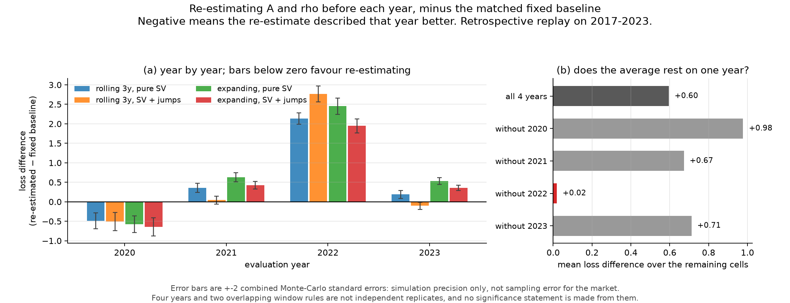
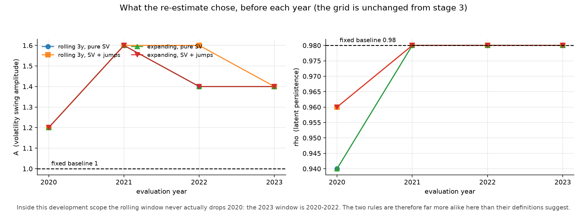

# Market stage 4 — a retrospective walk-forward replay

Does re-estimating `A` and `rho` before each year describe the following year better than leaving them fixed? Development scope 2017-01-01 to 2023-12-31, 1,759 returns. 2024-2025 is not read, not plotted and not measured. The returns frame is truncated at the development end on load.

**RETROSPECTIVE replay on history that has already been examined. Re-running a calibration on data we have already studied is not the same as having run it live, and nothing here is evidence about a future year.**


## 1. Corrections to the stage-3 record

recomputed from outputs/market/market_stage3_*, which are unchanged. Stage 3's numbers all stand; what is corrected is how they were described.

**(a) Order of operations.** Stage 3 implied that both validation loss definitions were fixed before any validation number existed. In fact the smoke run of run_market_stage3 executed the WHOLE pipeline, including the validation period, and printed validation losses. The validation-length standardisation was added AFTER that output had been seen, and the code comment claiming otherwise was wrong. loss_frozen_training_scales remains the pre-specified primary result. loss_validation_length_scales is a POST-HOC SUPPLEMENTARY analysis. Its agreement with the primary ordering is therefore weaker evidence than stage 3 presented it as, and it selects nothing. the grid, the objective, the selection rule and the selected parameters were all fixed before the search and are untouched by this correction.

**(b) Attribution withdrawn.** "the cause lies in the market itself, not in the fitting process" is withdrawn. a transfer failure across periods was observed. This round cannot separate the contributions of a change in the data-generating mechanism, finite-sample variation in either period, uncertainty in the estimated parameters, and model misspecification. The market statistics do differ sharply between the two periods; that is an observation, not an attribution.

**(c) Fitted versus held out.** The objective is exactly `rv21_q10`, `rv21_q50`, `rv21_q90`, `acf_absret_lag1`, `acf_absret_lag5`, `acf_absret_lag10`, `acf_absret_lag21`, `acf_absret_lag63`. the RV_21 quantiles and the absolute-return ACF are the objective itself and must never be cited as held-out evidence. stage 3 reported that no held-out statistic moved from inside the simulated range to outside. That test cannot see a centre that drifted while staying inside a wide band, so the centre error is checked here as well, scaled by the baseline's own band.

Re-checking the centre, scaled by the baseline's own 2.5–97.5% width:

| branch | held-out statistics checked | centre error worse | better | essentially unchanged |
|---|---|---|---|---|
| pure SV | 24 | **2** | 10 | 12 |
| SV + jumps | 24 | **4** | 12 | 8 |

The statistics whose centre moved away from the sample:

| branch | statistic | baseline centre error | calibrated | change |
|---|---|---|---|---|
| pure SV | `tail_above_p3_count` | 0.000 | 0.273 | +0.273 |
| pure SV | `agg21d_excess_kurtosis` | 0.037 | 0.113 | +0.076 |
| SV + jumps | `tail_above_p3_count` | 0.000 | 0.273 | +0.273 |
| SV + jumps | `agg21d_excess_kurtosis` | 0.051 | 0.172 | +0.122 |
| SV + jumps | `tail_above_p2_count` | 0.524 | 0.571 | +0.048 |
| SV + jumps | `acf_ret_lag1` | 1.656 | 1.680 | +0.024 |

So stage 3's "nothing broke" was too generous: two statistics for pure SV and four for SV+jumps had their centre drift away while staying inside a band that had itself widened. `tail_above_p3_count` is the clearest case — the baseline matched it exactly and the calibrated version does not.

**(d) Scope and uncertainty.** stage 3's statement that the two target groups cannot be satisfied together holds FOR THIS GRID AND THIS OBJECTIVE. A different target set, a different weighting or a wider grid could change it. It is not a proof about the model family.

Three different uncertainties, only one of which is quantified anywhere in stages 3 and 4:

- **simulation standard error** — how much a reported loss or median moves if the same model is simulated again. Reported as loss_mc_se, and it is the only one stage 3 quantified.
- **market sample uncertainty** — how much the SAMPLE statistic would move on another draw of the same length from the same market. NOT quantified: one history, no replicate.
- **parameter uncertainty** — how much the selected (A, rho) would move on another sample. NOT quantified. Every simulated range in stages 3 and 4 is conditional on the selected parameters and contains none of it.


## 2. The replay protocol, frozen before the run

- Evaluation years [2020, 2021, 2022, 2023]; calibrate once before each year, frozen inside the year. Neither the window length nor the update frequency is searched.
- Window rules: **rolling 3y** — the three calendar years before the evaluation year; **expanding** — 2017 through the year before the evaluation year. for 2020 the two rules coincide (2017-2019), so that year carries no information about the choice between them
- Grid: the stage-3 grid, unchanged. It is NOT widened if a result is poor.
- Comparison: A and rho re-estimated on the window against A = 1.0, rho = 0.98. both use the SAME overall scale, estimated from that window. The scale is never derived from the evaluation year.
- Objective: the stage-3 objective, unchanged: RV_21 quantiles compared in logs and the centred-absolute-return ACF at lags [1, 5, 10, 21, 63], two groups of equal total weight. A finite-sample simulated-moment distance, not a likelihood and not a test.
- Calibration reference: built at EACH origin from then-available information: the baseline parameters, the window's own scale estimate and the window's length. Fixed across candidates inside that calibration. The stage-2 full-training reference is NOT carried into early windows -- it contains information from after them.
- Evaluation reference: ONE reference per (year, branch), shared by every method scored that year: baseline parameters, the scale from the EXPANDING window ending before the year, and a length equal to the year's trading-day count, which is a calendar fact. A single shared reference is what makes the methods comparable; it cannot favour one of them.
- every evaluation statistic is computed inside the evaluation year, identically for the market and for every simulated path. RV_21 therefore begins on the 21st trading day of the year. No statistic crosses the boundary, so no embargo is imposed.
- the log-variance AR(1) starts from its stationary law. This is a check on whether the distribution SHAPE transfers after a rolling re-fit; it is not a conditional forecast and the latent state is never filtered on the real path.
- Auxiliary diagnostics (13 of them) are reported every year, NEVER added to the objective whatever they show

**Time-boundary check.** Multiplying every return after the rolling3y origin for 2021 by −3 and adding 0.05 — 753 returns — left the chosen `A`, `rho`, the scale, the window size, the calibration loss, the seed and the standardising scales **identical**: `True`. The calibration only ever sees `data_up_to(origin)`.


## 3. Results



Full table — every year, both window rules, both branches. A negative difference means the re-estimate described that year better.

| year | rule | branch | window | A | rho | re-estimated loss | fixed baseline | difference | ±2 MC s.e. | beyond MC noise |
|---|---|---|---|---|---|---|---|---|---|---|
| 2020 | expanding | SV + jumps | 2017–2019 | 1.2 | 0.96 | 7.360 | 8.002 | **-0.642** | 0.231 | True |
| 2020 | rolling 3y | SV + jumps | 2017–2019 | 1.2 | 0.96 | 7.512 | 8.017 | **-0.505** | 0.234 | True |
| 2020 | expanding | pure SV | 2017–2019 | 1.2 | 0.94 | 6.068 | 6.642 | **-0.573** | 0.215 | True |
| 2020 | rolling 3y | pure SV | 2017–2019 | 1.2 | 0.94 | 6.082 | 6.570 | **-0.487** | 0.206 | True |
| 2021 | expanding | SV + jumps | 2017–2020 | 1.6 | 0.98 | 1.437 | 1.011 | **+0.426** | 0.096 | True |
| 2021 | rolling 3y | SV + jumps | 2018–2020 | 1.6 | 0.98 | 1.454 | 1.410 | **+0.044** | 0.100 | False |
| 2021 | expanding | pure SV | 2017–2020 | 1.6 | 0.98 | 1.767 | 1.141 | **+0.626** | 0.118 | True |
| 2021 | rolling 3y | pure SV | 2018–2020 | 1.6 | 0.98 | 1.879 | 1.524 | **+0.355** | 0.114 | True |
| 2022 | expanding | SV + jumps | 2017–2021 | 1.4 | 0.98 | 4.030 | 2.084 | **+1.946** | 0.179 | True |
| 2022 | rolling 3y | SV + jumps | 2019–2021 | 1.6 | 0.98 | 4.294 | 1.526 | **+2.767** | 0.201 | True |
| 2022 | expanding | pure SV | 2017–2021 | 1.4 | 0.98 | 4.874 | 2.422 | **+2.452** | 0.207 | True |
| 2022 | rolling 3y | pure SV | 2019–2021 | 1.4 | 0.98 | 3.958 | 1.825 | **+2.133** | 0.145 | True |
| 2023 | expanding | SV + jumps | 2017–2022 | 1.4 | 0.98 | 0.973 | 0.614 | **+0.359** | 0.068 | True |
| 2023 | rolling 3y | SV + jumps | 2020–2022 | 1.4 | 0.98 | 1.257 | 1.361 | **-0.104** | 0.089 | True |
| 2023 | expanding | pure SV | 2017–2022 | 1.4 | 0.98 | 1.219 | 0.684 | **+0.534** | 0.087 | True |
| 2023 | rolling 3y | pure SV | 2020–2022 | 1.4 | 0.98 | 1.565 | 1.376 | **+0.190** | 0.104 | True |

Re-estimating beat its matched baseline in **5 of 16** year-rule-branch cells. Mean difference **+0.595** (positive = re-estimating worse).

### Per year

| year | mean difference | best cell | worst cell | cells where re-estimating won |
|---|---|---|---|---|
| 2020 | -0.552 | -0.642 | -0.487 | 4 of 4 |
| 2021 | +0.363 | +0.044 | +0.626 | 0 of 4 |
| 2022 | +2.325 | +1.946 | +2.767 | 0 of 4 |
| 2023 | +0.245 | -0.104 | +0.534 | 1 of 4 |

### Does the average rest on one year?

**Yes — almost entirely on 2022.**

| cells included | mean difference |
|---|---|
| all four years | +0.595 |
| without 2020 | +0.977 |
| without 2021 | +0.673 |
| without 2022 | +0.019 |
| without 2023 | +0.712 |

Drop 2022 and the average is +0.019 — a wash. 2022 alone contributes a mean of +2.325, and it is the only year in which every cell loses by more than 1.9. Any summary that quotes the four-year average without saying this is misleading.

### Which component moves

| year | volatility-distribution component | clustering component |
|---|---|---|
| 2020 | +0.402 | -1.505 |
| 2021 | -0.282 | +1.008 |
| 2022 | +3.058 | +1.591 |
| 2023 | -0.217 | +0.706 |

In 2020 the gain comes from the clustering group; the volatility distribution gets slightly worse. In 2022 both deteriorate and the volatility distribution dominates.

### Parameters chosen



| year | rolling 3y, pure SV | rolling 3y, SV+jumps | expanding, pure SV | expanding, SV+jumps |
|---|---|---|---|---|
| 2020 | A=1.2, rho=0.94 | A=1.2, rho=0.96 | A=1.2, rho=0.94 | A=1.2, rho=0.96 |
| 2021 | A=1.6, rho=0.98 | A=1.6, rho=0.98 | A=1.6, rho=0.98 | A=1.6, rho=0.98 |
| 2022 | A=1.4, rho=0.98 | A=1.6, rho=0.98 | A=1.4, rho=0.98 | A=1.4, rho=0.98 |
| 2023 | A=1.4, rho=0.98 | A=1.4, rho=0.98 | A=1.4, rho=0.98 | A=1.4, rho=0.98 |

Every selected cell lies inside the grid (no boundary solutions). `A` rises from 1.2 before 2020 to 1.6 before 2021 and settles at 1.4; `rho` rises from 0.94–0.96 to 0.98 and stays. Every re-estimate sits above the baseline `A = 1.0`.

### Rolling against expanding

| rule | branch | mean difference | cells won |
|---|---|---|---|
| expanding | SV + jumps | +0.522 | 1 of 4 |
| expanding | pure SV | +0.760 | 1 of 4 |
| rolling 3y | SV + jumps | +0.551 | 2 of 4 |
| rolling 3y | pure SV | +0.548 | 1 of 4 |

**The two rules barely differ, and this replay cannot separate them.** Inside 2017-2023 the rolling window never actually drops 2020: the window before 2023 is 2020-2022. The first rolling window that excludes 2020 would be the one before 2024, which is in the holdout and is not read. The near-identical parameter paths are a consequence of the scope, not evidence that window length does not matter.

### Auxiliary diagnostics

Thirteen statistics were tracked every year and **none was added to the objective**. Counting how often the sample value falls inside the simulated 2.5–97.5% range, across all years and cells:

| statistic | re-estimated inside | fixed baseline inside |
|---|---|---|
| `skewness` | 100% | 100% |
| `excess_kurtosis` | 25% | 56% |
| `tail_below_m2_count` | 100% | 100% |
| `tail_above_p2_count` | 100% | 100% |
| `tail_below_m3_count` | 100% | 100% |
| `tail_above_p3_count` | 100% | 100% |
| `acf_ret_lag1` | 75% | 75% |
| `acf_ret_lag5` | 100% | 75% |
| `acf_sqret_lag1` | 25% | 56% |
| `acf_sqret_lag5` | 100% | 94% |
| `leadlag_ret_vs_future_sq_lag1` | 100% | 100% |
| `leadlag_ret_vs_future_sq_lag5` | 100% | 100% |
| `concentration_max_exceed_63d` | 75% | 88% |

These are coverage counts over overlapping cells, not a score and not a test.


## 4. What this does and does not settle

**What the replay shows.** On this objective, over these four years, re-estimating `A` and `rho` before each year did **not** describe the following year better on average. It helped in 2020, was roughly neutral to mildly worse in 2021 and 2023, and was clearly worse in 2022. Fifteen of the sixteen differences are larger than twice the combined simulation error, so they are not Monte-Carlo artefacts.

**What it does not show.**

- four years and two overlapping window rules are not independent replicates; no significance statement is made from them
- a failure is not attributed to a regime change by default
- the main window rule is not swapped on the strength of the replay
- every simulated range is conditional on the model AND the parameters, and carries no parameter-estimation uncertainty
- 2020 is the one year where the calibration window contained no extreme episode and the evaluation year did; 2022 is the reverse. The replay cannot tell whether that ordering is the mechanism or a coincidence of four draws.
- No failure here is attributed to a regime change. That would be a claim about the data-generating process, and this design cannot separate it from finite-sample variation, parameter uncertainty or model misspecification.
- The main window rule is **not** being swapped on the strength of this replay, and the grid was not widened when results were poor.

**A point that matters for the wider project.** A generator that re-estimates well would still say nothing about whether the monitor's two-year 15% cumulative false-alarm control survives. If a periodic parameter update were ever used inside a live monitor, the whole rule *including the update action* would have to be recalibrated as one procedure. A monitor does not get to draw a fresh 15% budget each time its generator is updated.


## 5. Reproducing

```bash
.venv/bin/python -m strategy_survivorship.run_market_stage4
.venv/bin/python -m strategy_survivorship.report_market_stage4
.venv/bin/python -m pytest tests/test_market_stage4.py -q
```

Stage 3's outputs are unchanged; the corrections to its write-up live in `market_stage4_stage3_corrections.json` and in section 1 above. The monitors, the EWMA code, `mixed_noise` and every earlier simulation result are untouched, no new model family was added, and nothing was committed or pushed.
